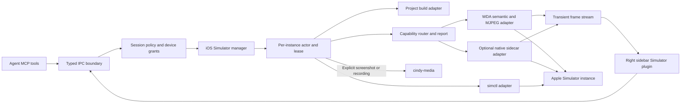

# Cindy Desktop iOS Simulator 集成计划

> 状态：Phase 0 已完成；Phase 1 主链路与协同 UI 已落地；Phase 2/3 的可自动验证基础设施、shutdown/WDA 恢复、退出 fail-closed、archived 回收、多实例独立 tile 操作和 simctl 设备状态工具已落地。
>
> Phase 4A 已完成进程托管与 capability probe：可组合 driver contract、capability router/report、5-byte framed protocol、`IOSSimulatorNativeSidecarAdapter`、有界 stdio channel、崩溃预算/parked/re-arm、最小环境、握手校验和 CoreSimulator/SimulatorKit 探测已落地。Phase 4B 已实现精确 UDID 的 IOSurface 单帧 capture、有界逐帧确认 BGRA correctness stream、VideoToolbox 硬件 H.264 Annex-B producer、`configureStream` / `startStream` 产品 operation、vImage 缩放/方向变换、Main 到 Renderer 的 capability-gated transport、真实 Electron 生产 WebCodecs decoder reset/recovery、30 分钟长稳和四实例资源/降档门禁，以及 native 断流后 MJPEG 接管和显式 re-arm。Phase 4C 已实现精确设备的连续单指/双指 HID、Abort/takeover/detach/SIGKILL 后的触点释放，以及 MCP `touch_path` / `touch2_path`。Phase 4D-1 已建立 Xcode/runtime/architecture compatibility matrix；Phase 4D-2 已建立 host-owned runtime capability admission，分离 requested、compatible、detected、admitted 与 active，并对 artifact trust、资源门禁和 parked 状态 fail-closed；Phase 4D-3 已把启动中止、WDA/Sidecar 联合停止、Session stale binding、设备 shutdown、orphan reconcile 与 Desktop quit 收敛到现有 owner/shutdown gate；Phase 4D-4 已接入 macOS deny-by-default OS sandbox、最小环境与每实例临时目录回收，并完成真实 framebuffer/H.264/HID 沙箱门禁。Phase 4E 已新增 Host-owned capability provider、artifact resolver、admission policy 与 supervisor 边界，当前内置 Sidecar 已迁移为默认 provider，未来插件只能提供 artifact 候选，不能直接启动或接管 Sidecar。Phase 4F-1 已把正式分发 artifact 收敛为 Cindy 内置后台 Helper bundle；Phase 4F-2 已接入 Helper 内外层签名顺序、Hardened Runtime、主 App 封印的 identity manifest、packaged artifact 验证与每次启动前摘要复验；Phase 4F-3 已把正式包的原生能力提升接入 Host-owned 精确 release registry；Phase 4F-4 已新增最终签名/公证后的 packaged release gate，默认验证信任链、精确 compatibility 与 fail-closed fallback，受控发布环境可显式运行临时设备的 H.264/HID/restart 黑盒门禁。当前产品运行时采用“known-good 直接启用、unknown 默认尝试并等待 Sidecar probe、known-bad 硬拒绝并回退 WDA/MJPEG”的策略；发布 gate 仍独立要求 exact eligible。面板会分别显示实际 H.264/HID route 与 detecting/fallback/reconnecting/unavailable 状态。系统 bezel 手势、真实发布证书环境的 native gate、差异图像导出和最终手动验收仍需后续迭代。
>
> 关联 Issue：[#397](https://github.com/xindong/cindy-moved/issues/397)
>
> 适用平台：macOS
>
> 更新时间：2026-08-13

## 0. 当前实施状态

截至 2026-07-25，已完成以下可进入产品集成验证的生产路径：

- 新增 host-neutral `@cindy/ios-simulator-runtime`，通过 argv 方式调用 Apple 工具并解析 `simctl list -j`，不执行 shell。
- Desktop main 以真实 Session 记录为准，local macOS 会话可发现环境；缺失、已删除、SSH/remote Session 均 fail-closed。
- 新增默认启用、允许用户或项目显式关闭的 `cindy_ios_simulator` Agent provider，已经覆盖环境/设备/实例生命周期、screen map、基础输入、App build/install/launch/terminate/open URL、截图录屏和诊断工具。这样 iOS 请求可直接进入内嵌流程，而无需用户先为每个项目手动开启插件。
- 内嵌与外部模拟器的路线选择由插件 Skill/Agent 负责：内嵌能力可用且适合任务时优先使用 `cindy_ios_simulator`，不可用或用户需要系统窗口时可以走普通 shell、Xcode、Simulator.app、`simctl` 或 Computer Use。Desktop 不再注入 iOS 专用 shell policy、Claude hook 或 Codex PATH shim；外部命令继续服从 Agent 原有权限与审批机制。
- Computer MCP 不再对 Xcode/Simulator.app 设置 iOS 专用路由硬闸；启动、点击、快捷键和轨迹回放均走普通桌面驱动。工作目录路径边界、窗口快照代际、轨迹不可变预检、取消与执行预算等通用安全保护保持不变。内嵌 Host 的 session ownership、generation、lease、设备准入、跨任务隔离与 cleanup 仍由 Host 强制执行，不依赖 Skill 自觉。
- 新增非 singleton 的 `ios-simulator` right-sidebar plugin；用户可手动打开、attach、启动/停止/解绑设备、管理 Agent 设备授权，并查看 main 内存中的实时 JPEG stream 与 FPS/连接状态。
- manual pane 与 Agent tool gate 分离：关闭实验性 Agent tool 不影响用户查看本机设备状态。
- 已覆盖 runtime parser、MCP envelope/session context、main host/IPC、远程会话拒绝、renderer 状态展示和 plugin provider 映射测试。
- 新增 host-neutral automation driver 契约、WDA source pin、checkout inspection、build/launch argv plan、loopback-only HTTP client 和 bounded MJPEG parser；driver 已拆成 semantic、discrete input、JPEG stream 能力面，WDA 保持默认实现。
- 新增 capability router/report、5-byte bounded sidecar protocol、按精确 UDID/generation 绑定的 `IOSSimulatorNativeSidecarAdapter` 和 native process manager；native executable 已开放只读单帧 correctness capture、H.264 产品连续流和连续 HID。Development 与 packaged 运行时都默认按能力尝试 Native；兼容矩阵 `unknown` 只进入 probation/handshake，不再阻止 Sidecar 启动，明确不兼容、artifact 不可信、资源拒绝或进程 parked 仍硬拒绝并回退 WDA/MJPEG。`CINDY_IOS_SIMULATOR_NATIVE_H264=0` / `CINDY_IOS_SIMULATOR_NATIVE_HID=0` 仍可作为开发诊断关闭开关。BGRA 产品流固定关闭。
- native process manager 已实现 argv-only 绝对路径启动、POSIX process-group kill、最小环境变量白名单、协议/能力/UDID/generation handshake、availability probe、实例级 stop，以及同 identity 的 restart/re-arm；WDA manager 可在不重启 WDA session 或 simulator 的前提下重新握手、probe 并原子替换 capability router，失败仍只保留 MJPEG fallback。
- Native Sidecar 与 WDA process manager 的 `stop()` 现在会确定性等待同 instance 的 in-flight start/recover：stop 先让已创建 channel 进入 stopped 并中止 pending request，晚到的 handshake/availability/restart 不会重新写回 running binding；重复 stop 共用同一收敛操作。WDA owner 同样等待正在 build/start 的 operation，完成后删除 session、结束 WDA 和 Sidecar，不把晚到子进程留给 Desktop quit。
- WDA controller 与 Simulator 内独立 Runner 共享由 profile、instance 和精确 UDID 推导的非敏感 owner fingerprint。Main 被 `SIGKILL` 后，新 Host 会先用无环境变量的进程清单筛出精确候选，再只读取候选 Runner 的 owner 标记并回收对应进程组；无法证明归属的同设备 WDA 不会被终止，也会阻止 Cindy 启动第二套 WDA。归档与删除任务都会在启动恢复中重试 runtime quiescence，但只有删除任务会移除媒体引用。
- macOS-only sidecar executable 已实现精确 UDID 设备查找、0～16 有界 screen ID discovery、`IOSurfaceLock(.readOnly)`、BGRA pixel format/尺寸/stride/byte limit 校验和立即复制解锁；单帧通过现有 `StreamFrame`/`StreamEnd` 传输，不新增网络端口或持久媒体旁路。
- arm64 与 x86_64 分别使用最小 ABI shim 调用 private Swift getter，显式满足其 method-self 寄存器约定，不依赖优化器偶然分配；`native:build` 生成架构专属 sidecar 并清理中间 object。
- sidecar handshake 会报告 sanitized `framebufferSymbols`、`framebufferCapture` 和 width/height/bytesPerRow/byteCount/screenId/pixelFormat；framework 路径、IOSurface 句柄和原始 stderr 不进入 renderer/Agent diagnostics。
- `captureNativeFrame()` 是独立的 correctness API，不受 `bgraStream` capability 控制；正式 `h264Stream` 只有在 sidecar 收到 `--enable-h264-stream` 且 framebuffer ready 时为 true，`continuousInput` / `multiTouch` 只有在收到 `--enable-continuous-input` 且精确设备 HID client 初始化成功后为 true，`bgraStream` 始终为 false。Host 默认发放 probe 请求，Sidecar handshake 才能把单项能力提升为 active；开发环境变量仅保留 `0` 的显式关闭语义。packaged/release 仍由 artifact trust、资源策略和 release gate 共同约束，renderer、Agent、插件或 Sidecar 自报都不能绕过 Host admission。
- Phase 4C 在 Xcode 26.4 使用 `IndigoHIDMessageForMouseNSEvent` 构造 digitizer 消息，并通过 `_TtC12SimulatorKit24SimDeviceLegacyHIDClient` 的 `initWithDevice:error:` / `sendWithMessage:freeWhenDone:completionQueue:completion:` 发往精确 UDID。实际 ABI 使用 point1、可选 point2、target、event type、设备尺寸和 edge；双指由同一消息的第二个可选 point 表达，不拆成两个并发单指请求。
- native gesture 只接受 0～1 normalized 坐标、最多 4096 个 sample、最长 60 秒和至少 4 ms 的 move 间隔；双指路径必须 sample 数、phase 与 timing 完全同步，且不接受 system-edge 参数。Desktop 从 WDA viewport metadata 把设备 point 坐标归一化，不使用 renderer DOM 尺寸猜测坐标。
- `tap`、`type_text`、`press_home` 和 accessibility/screen map 继续由 WDA 负责；`swipe` 仅在 native continuous input capability 可用时走原生路径，否则保留 WDA fallback。显式 `touch_path` / `touch2_path` 不做部分执行后的 replay fallback，避免重复手势。
- 所有 native HID tool 继续经过 Session ownership、per-device grant、generation/lease route、accessibility snapshot、instance actor mutation serialization、busy/takeover gate。用户 takeover 会 Abort 活动 Agent gesture；正常 stop 先 `detach`，Abort 发 `stopStream`，sidecar 异常路径补发 release，同 identity SIGKILL recovery 在重新握手后发送 stale-contact release。
- `streamNativeBgraCorrectnessFrames()` 提供 1～15 FPS、1～900 帧、单帧 hard byte limit 的内部稳定性门禁；sidecar 同时只接受一条 correctness stream，每帧必须等 host callback 完成并确认后才继续采集，慢消费者不会形成无界 native/Node 队列。
- `streamNativeH264CorrectnessFrames()` 提供 1～30 FPS、1～900 帧的内部 producer 门禁：每帧把只读 IOSurface 快照逐行复制到 BGRA `CVPixelBuffer`，交给 realtime hardware-only VideoToolbox session 编码，再把 AVCC NAL 转成 Annex-B；首帧、分辨率重建帧和周期帧强制关键帧，关键 access unit 前注入 SPS/PPS。该 API 与 BGRA correctness stream 共用单流仲裁、逐帧 ACK、连续 sequence、abort 和 hard byte limit，不受正式 `h264Stream` capability 控制。
- Renderer 已新增独立 `IOSSimulatorH264Decoder`：解析 Annex-B，并把 4-byte length-prefixed access unit 规范化为 Annex-B；从 SPS 推导 `avc1` codec，使用 `prefer-hardware` / `optimizeForLatency` WebCodecs 配置，首个关键帧必须携带 SPS/PPS。generation、尺寸或 decoder error 会关闭旧 decoder 并等待新关键帧，旧 generation output 和 unmount 后 output 会立即 `VideoFrame.close()`。
- Decoder 已实现有界失败策略：WebCodecs 缺失、不支持的配置、持续缺少关键帧或连续 decoder error 只触发一次 MJPEG fallback；控制器不清空调用方当前 canvas/JPEG，因此 pane 会保留最后画面直到 MJPEG 首帧接管，避免切换白屏。真实 Electron 门禁已使用隐藏且 sandboxed 的本地 Renderer、strict CSP、无 preload/Node 权限的 Chromium `VideoDecoder` 完成 1 帧与 5 帧产品流解码；access unit 入队后立即确认，流末统一 `flush()`，避免逐帧 flush 破坏 P 帧依赖或把 sidecar ACK 错绑到 decoder 内部缓存。
- Main 已新增独立 `IOSSimulatorH264FramePump`：只接受 capability router 选中的 native driver，先配置 H.264 profile，再保留一个最新 access unit；profile/generation/driver 切换会 abort 旧流并等待旧任务退出后启动新流，避免同 sidecar 双流竞争，同 generation 切换 driver/profile 时保持 host sequence 单调。默认 payload 上限从 16 MiB protocol body 扣除 4-byte 前缀与 64 KiB metadata，并由 protocol、adapter 和 pump 共用同一常量。Renderer IPC 只获得复制后的 H.264 bytes 与 sanitized frame metadata。
- SimulatorKit 暴露的是固定物理 portrait IOSurface，设备 UI orientation 不会通过 surface 尺寸变化表达。产品 profile 因此由已授权的 WDA host 同步传入 `PORTRAIT` / `LANDSCAPE`；landscape 在 VideoToolbox 前通过 vImage 顺时针旋转 90°，profile 切换会重建 encoder 并强制首帧 IDR。真实临时设备已完成 portrait 602×1310 → landscape 1310×602 → portrait 602×1310，三段首帧均为关键帧，设备与进程均在 `finally` 清理。
- 详情 pane 在 WebCodecs 可用时请求 H.264，并用常驻 canvas 绘制；首个 H.264 output 成功前继续保留当前 JPEG，decoder fallback 会通过同一 viewer lease 明确请求 JPEG。多实例 grid 显式固定 JPEG，避免为后台 tile 创建多个 decoder。Main 若观察到 native stream disconnected，会自动停掉 H.264 pump 并启动 WDA/MJPEG；用户下一次显示请求会对 unavailable/parked sidecar 做显式 re-arm，而 capability 存在但不支持 H.264 的 packaged 路径不会反复重启。
- persisted ownership reconcile 对 missing/deleted/archived Session 和已 shutdown/丢失的设备先停止 frame pump、录屏、WDA 与 Sidecar，再按 creation/boot provenance 决定是否 shutdown/delete 设备；driver runtime 停止失败时保留 degraded ownership 供下次重试，不继续修改设备。外部 preexisting 设备仍不被 shutdown/delete。
- correctness stream 每帧重新读取当前 IOSurface，并重新生成 width/height/bytesPerRow/orientation metadata；sequence 必须从 0 严格连续，UDID/generation 固定。显式 abort 会唤醒等待中的 producer、输出确定性 stream end，stdout 由单一锁串行写入，避免 reply/frame 字节交错。
- Phase 4B 已冻结 native frame contract：H.264 必须声明 Annex-B 或 4-byte length-prefixed 格式，校验 NAL 边界、NAL type 与 IDR keyframe 标记；BGRA 校验 stride、尺寸和字节数。native channel 在交付 callback 前执行同一套校验，异常只终止当前 stream 并保留 WDA fallback。
- native frame metadata 已固定 orientation、scale 和 color space 字段；其合法性与尺寸约束在 protocol decode、channel 交付和 queue enqueue 三层保持一致，为后续方向/尺寸变化与坐标转换保留确定性输入。
- native stream consumer 已接入有界 latest-frame queue：sidecar callback 只复制并入队，慢 renderer 会丢弃旧帧而不积压 native bytes，并返回 depth、byteCount、droppedFrames、droppedBytes 统计；队列中的 transient frame 不写入媒体总仓。
- 已在本机 Xcode 26.4 + iOS 26.1 + WDA v15.1.6 完成 build/launch、status、session、accessibility source 和 3 帧 MJPEG client smoke。
- 已在独立创建且验证后删除的 iOS 26.4 临时 simulator 上完成 tap、type、swipe、Home 和 orientation mutation smoke；未操作用户已有设备。
- 已完成单实例 30 分钟 MJPEG 稳定性测试和受控 WDA stop/restart：无 silent stall，服务端 EOF 可确定识别，重启后 status/accessibility/session/stream 均恢复。
- 已完成 1/2/4 台 iOS 26.4 simulator 的稳态 MJPEG 资源基准：每路约 4.60-4.62 FPS、0.60-0.61 MiB/s；四路合计 18.42 FPS、2.42 MiB/s，未发生提前 EOF。
- 已用 macOS `footprint` 完成 1/2/4 台 simulator 进程树共享页去重：平均约 2.22/4.66/9.30 GiB；此前 RSS 求和放大约 13-16 倍，不能作为产品内存上限。
- 已完成 Simulator.app quit/hide 真实门禁：quit 会让所有 Booted 设备进入 shutdown 并导致 WDA stream EOF；公开 `NSRunningApplication.hide()` 可在不申请 Accessibility/Screen Recording 权限的前提下保留设备、WDA、accessibility 和 MJPEG。
- 已完成同设备动态 MJPEG/H.264 对照：H.264 带宽约低 34 倍、VideoToolbox 编码额外约 1.9% CPU，但首字节约 673 ms；Phase 1 继续使用低首帧 MJPEG，原生 framebuffer/H.264 路径独立进入 Phase 4。
- WDA 产品化获取方式已定为随包携带固定源码归档；v15.1.6 tag 对应 pin revision，归档约 536 KiB，SHA256 为 `98c8f7102768aa10530c9b124be39d66a06a146631708416348b88f2db1a56c3`。
- WDA build/launch 子进程已改用最小环境白名单，避免 Xcode scheme 把 Desktop/Agent secret 继承并打印到构建日志。
- 已实现 ownership、lease、generation、跨 Session 占用拒绝、每设备 Agent grant、精确 UDID 生命周期与 10 分钟 grace 语义。
- 已实现固定 WDA 源码归档随包、校验解包、按 source/Xcode/runtime/arch 缓存的构建与进程管理；Xcode 计划使用 `-quiet` 保持有界日志。
- 已实现稳定 element ID、旧 screen snapshot 拒绝、每实例输入串行、操作后 snapshot 失效和 bounded MJPEG 自动重连。
- 已实现 Generic Xcode 与 Cindy Mobile project adapter；`build_app.projectDir` 可显式选择任务目录外的本地工程或 worktree，省略时每次回到当前任务目录。App artifact 记录实际构建目录，并继续绑定当前任务的实例；不向 MCP 或 renderer 暴露本地绝对路径、端口和原始 Xcode 输出。
- 显式截图/录屏已接入 `cindy-media` Session 引用；stop/detach 会终止活动录屏并清理临时目录，transient frame 始终只在内存。
- 已实现 Session 级有界 diagnostics store，以及全局串行 start、soft limit 2、hard limit 4、内存余量拒绝的 resource scheduler。
- build 与 open URL 使用逐次审批，设备 mutation 使用 per-device grant，两类权限不能互相替代。
- 新增永久真实烟测：创建临时 iOS 26.4 设备、boot、WDA、accessibility、MJPEG profile、lock/unlock、PNG screenshot，并在 `finally` 中 shutdown/delete；本机已通过且无设备残留。SpringBoard 不保证可旋转，因此 orientation 在通用烟测中作为 capability probe，严格旋转验证需前台运行可旋转 App。
- 已完成可旋转 App 真实门禁：临时 iOS 26.4 设备通过 `simctl launch com.apple.mobilesafari` 前台启动 Safari，WDA `LANDSCAPE`/`PORTRAIT` 切换成功，烟测结束后临时设备已删除。
- 新增显式恢复烟测：关闭整个 `Simulator.app` 后，清理旧 WDA、精确重启临时设备与 WDA，并恢复关闭前用户已 boot 的设备；本机已通过。产品 pane 对 disconnected stream 采用 3 秒有界重试并在 host 内重建 WDA。
- 新增可重复的 `test:real-multi-smoke`：默认创建 4 台临时 iOS 26.4 设备，30 秒并行读取 WDA MJPEG，结束后自动 stop/shutdown/delete；本轮四路均以受控 abort 结束，无 EOF，实测约 4.60–4.63 FPS、0.605–0.610 MiB/s/路，首帧 124–208 ms。单路 20 FPS profile 10 秒门禁本轮实测约 15.09 FPS、1.983 MiB/s（此前单次实测 17.29 FPS），证明高档 profile 可用但目标 FPS 不是硬保证。
- 新增 `test:real-multi-recovery-smoke`：可创建 2～4 台临时设备，关闭 Simulator.app 后分别处理自然 shutdown/显式 `simctl shutdown`，逐个重建 WDA 并验证 status、accessibility 和首帧；本机已通过 4 台 iOS 26.4、2 台 iOS 18.5。
- 新增 `test:real-device-controls-smoke`：在临时设备上真实验证 appearance、location set/clear、两 waypoint location route、privacy grant/revoke/reset、status-bar override/clear，并在 `finally` 中 shutdown/delete；本机 iOS 26.4 已通过，无设备残留。
- 新增 `test:real-push-smoke`：临时用 XcodeGen 生成带 `aps-environment=development` 的 App，真实注册远程通知、调用 `simctl push` 并从 App container 验证唯一 payload marker；本机 iOS 16.4 已通过，临时设备自动清理。
- 新增 `compatibility:smoke`：按 runtime 选择器串行执行单实例 smoke/recovery，汇总 Xcode/WDA pin、每个 runtime 的结果和退出码；新增 `.github/workflows/ios-simulator-compatibility.yml`，按周在 macOS runner 归档 report/smoke artifact。
- 最新自动验证：runtime 31 files / 187 tests、runtime build 和 macOS arm64 sidecar build、Desktop typecheck、Desktop iOS 定向 4 files / 53 tests、restart/brand runner 27 tests、仓库根 `pnpm test:unit` 均已通过；根门禁中的 Desktop 为 1,155 files / 12,260 passed / 2 skipped。真实 Electron WebCodecs 产品门禁也已通过 1 帧与 5 帧。`compatibility:smoke` 默认矩阵此前已自动跑通 iOS 16.4/18.5/26.4；18.5/16.4 的 recovery smoke、26.4 的四实例跨实例 recovery smoke 也通过，设备控制（含 Increase Contrast / Dynamic Type）、真实 push smoke 和 pixel visual diff host 契约也通过。
- 本轮复核：`CINDY_IOS_SIMULATOR_RUNTIMES=16.4 CINDY_IOS_SIMULATOR_COMPAT_RECOVERY=0 pnpm --filter @cindy/ios-simulator-runtime compatibility:smoke` 再次通过；临时 UDID、WDA 和诊断进程均已清理，用户原有 Booted 设备保持不变。
- Phase 4A 基础回归：runtime 23 files / 98 tests、Desktop iOS Simulator host 23 tests、runtime build 与 desktop typecheck 通过；capability report 已进入现有 WDA diagnostics，H.264/BGRA 请求在 native capability 不可用时明确回退 MJPEG。
- Phase 4B 单帧真实 smoke 已在本机 Xcode 26.4 的三个已启动 iOS runtime 上通过：两组 1206×2622/stride 4864 与一组 1080×2340/stride 4352 均通过 BGRA byte-count 校验，并与同 UDID `simctl io screenshot` 的 PNG 尺寸完全一致；arm64 与 x86_64 sidecar 均完成真实采集。
- Phase 4B 连续 correctness smoke 已通过：arm64 在 1206×2622/stride 4864 上以 5 FPS 连续 150 帧约 30 秒，1.91 GB transient BGRA 全部按序交付，sidecar 峰值约 180 MiB RSS / 6.1% CPU；10 FPS producer 配合 250 ms/帧慢 consumer 时总时长约 6.1 秒，证明逐帧 ACK 背压生效。1080×2340/stride 4352 的第二种尺寸和 x86_64 转译路径也通过短流；所有 smoke 均在第 3 帧 abort 门禁中确定停止，未修改、关闭或删除用户设备。
- Phase 4B VideoToolbox producer 真实 smoke 已通过：arm64 在 1206×2622 上以 5 FPS 输出 30 个 Annex-B access unit，首帧 NAL 为 SPS/PPS/SEI/IDR，30 帧内 3 个周期关键帧、sequence/timestamp 单调，约 5.88 秒输出 243,566 bytes，峰值约 204 MiB RSS / 16.6% CPU；x86_64 转译在 1080×2340 上也通过 3 帧与第 3 帧 abort。产品 operation 在 host opt-in 后完成 50% / 70% / 100% vImage 缩放 smoke，分别输出 602×1310、844×1834、1206×2622；50% 10 帧约 24,090 bytes，峰值约 198 MiB RSS / 20% CPU，首帧 NAL 为 SPS/PPS/SEI/IDR，maxFrames 与第 3 帧 abort 均确定结束。数据只在内存中流转。
- Phase 4B Renderer decoder correctness 已通过 10 个 decoder 单元测试，并新增 H.264 frame pump、host capability route/断流自动回退、IPC preference 校验和 pane canvas 首帧测试；覆盖 Annex-B/length-prefixed、SPS codec 推导、首帧等待、完整 2 秒 producer 关键帧周期、低延迟配置、generation/尺寸 reset、旧 output 丢弃与关闭、异步配置期间的 bounded latest-frame、WebCodecs 缺失、配置不支持、关键帧超时、连续 error budget、fallback 单次触发和 unmount 清理。
- Phase 4B 真实 Electron WebCodecs 产品门禁已通过：目标 framebuffer 为 1206×2622，50% 产品 profile 输出 602×1310、codec `avc1.4d001f`；1 帧门禁解码 1/1，5 帧门禁解码 5/5，5 帧共 21,649 bytes，stream end reason 为 `max-frames`。smoke 结束后 Electron 与 sidecar 均确定退出，不关闭、旋转、shutdown 或 reset 用户 simulator。
- Phase 4B 真实 fallback/re-arm 门禁已通过：临时 iOS 26.4 设备先产出 602×1310 H.264 IDR；受控停止 sidecar 后 H.264 pump 在 2 次有界尝试内进入 disconnected，并约 408 ms 由同一 WDA session 的 MJPEG 首帧接管；显式 re-arm 复用同一 UDID/generation，重新 handshake/probe 后恢复 H.264，host sequence 从 1 连续到 2，恢复首帧仍为 IDR。WDA、simulator 和 ownership 全程未重启，临时设备在 `finally` 删除。
- Phase 4B 真实生产 decoder reset/recovery 门禁已通过：smoke 把仓库中的 `IOSSimulatorH264Decoder` 编译后注入隐藏、sandboxed、strict-CSP 且无 preload/Node 权限的 Electron Renderer，并以真实 `VideoDecoder` / `EncodedVideoChunk` 解码 12/12 帧。单一生产 decoder 在同 generation 下完成 602×1310 → 722×1572 → 602×1310 两次尺寸 reset，共创建 3 个真实 WebCodecs decoder；受控停止并重启 sidecar 后，旧生产 decoder 确定返回 `closed`，新生产 decoder 从 602×1310 IDR 恢复，切换期间保留最后画面且没有触发 fallback。smoke 自建 iOS 26.4 临时设备，并在 Electron 退出前确认精确 UDID、sidecar 均已清理。
- Phase 4B 30 分钟产品 H.264 长稳已通过：临时 iOS 26.4 设备以 5 FPS / 50% profile 连续交付 9,000/9,000 帧，实际 4.995 FPS、900 个周期 IDR、最大帧间隔 321 ms，没有 sequence/timestamp/关键帧错误或 silent stall。602×1310 Annex-B 总计 126,490,531 bytes，平均约 70.2 KB/s，相对理论 BGRA 约 907:1；sidecar 361 次资源采样平均 CPU 3.13%、峰值 6%，RSS 首/末/峰值 188.3/180.0/188.3 MB，没有持续增长。临时设备和 sidecar 在 `finally` 清理。
- Phase 4B 四实例资源/降档门禁已通过：四台临时 iOS 26.4 设备先以 10 FPS / 50% 并行建立基线，四路实际均约 10.05 FPS；随后一条前台流切到 15 FPS / 50%（15.011 FPS、602×1310），三条后台流切到 5 FPS / 25%（均约 5.015 FPS、300×654），后台带宽从约 72～78 KB/s/路降至约 26 KB/s/路。四个 sidecar 平均总 CPU 16.58%、峰值 30.6%、峰值总 RSS 420,495,360 bytes；系统可回收内存比例从 56% 降到 38%，仍高于超过两实例时的 20% admission 门槛。首次运行还真实发现并修复 host 在本地 maxFrames 后提前 resolve、下一档命中 `BUSY` 的竞态；adapter 现在等待 sidecar terminal `StreamEnd` 后才允许 profile handoff。四台临时设备和进程均已清理。
- Phase 4C 真实 HID smoke 已在 Xcode 26.4 + iOS 26.4 的精确临时设备通过 capability probe、单指拖拽、双指手势、Abort release、sidecar `SIGKILL` 后 stale-contact release 和恢复后的下一次手势。受控记录 App 观察到单指 2 个 move / 1 个 ended，双指 `maxTouches=2` / 2 个 ended；Abort 与 crash recovery 后 `activeTouches=0`。临时设备与只属于该 smoke 的 sidecar 均在 `finally` 清理。
- edge 字段与从 x=0.001 开始的连续路径能被 sidecar 接受并完整结束，但 Xcode 26.4 下 UIKit `UIScreenEdgePanGestureRecognizer` 未把 synthetic Indigo HID 识别为真实 bezel event；后续替换为受控 pan recognizer 的导航门禁也未触发，App 保持在 detail screen。当前只承诺可靠的连续坐标路径，不承诺系统 Home/back/通知中心等 bezel gesture parity；该项进入 Phase 4D 的 Xcode/runtime compatibility matrix，不在生产代码中针对测试 App 特判。

packaged/release 的 native H.264 与 HID 已具备 Host-owned 准入与 WDA/MJPEG fallback；运行时对未收录组合采用 soft-open/probation，只有明确不兼容或硬门禁失败才直接拒绝。发布 gate 仍只接受完成真实门禁的精确组合。Phase 4B 的 producer、transport、fallback/re-arm、真实 decoder reset/re-entry、30 分钟长稳和四实例预算/降档门禁均已通过，Phase 4C 的单指、双指、中断和崩溃释放主链路也已完成。Cindy/WDA 发起的 portrait/landscape 切换已完成；App 自行改变方向时的主动发现仍需后续轮询或事件接入。差异图像导出、更多高级设备审计工具和 Cindy Mobile Metro 8081 的多 worktree 策略也仍在后续范围；已提供有界的 semantic screen-map diff 和像素指标 visual diff，基线只存在 main 内存、不进入媒体账本。

已先对 archived/deleted Session 做 fail-closed 路由，并将 archived ownership 按 provenance 安全回收；Phase 1 pane 手势/键盘、busy/takeover、自动聚焦、lock/unlock/rotate、动态 MJPEG stream profile 已落地；Phase 2 已覆盖 WDA 退出和 CoreSimulator shutdown 后的 bounded recovery；Phase 3 已有紧凑多实例实时概览、后台 5 FPS 分层 profile、scheduler、实例 selector、隔离基础和每 tile 独立 tap/swipe/Home/type_text/lock/rotate 操作。跨机器 compatibility matrix 与定期 smoke job 仍需继续维护。新增 `@cindy/ios-simulator-runtime compatibility:report`，可把当前 Xcode、iOS runtime、设备数量、WDA 固定 pin 和降级原因输出为 JSON，供定期 smoke job 归档。

补充：`push_notification` 与 `set_status_bar` / `clear_status_bar` 已完成实现、契约测试和真实 push black-box smoke；真实推送验证使用临时带 APNs 注册能力的 App，不能用 Safari 伪造通过。

## 1. 结论摘要

Cindy 可以实现 Session 级 iOS Simulator 能力，但不能把它理解成“把 Apple 的 Simulator.app 窗口嵌进 Electron”。Apple 当前没有提供一个同时满足无前台窗口、可嵌入、实时画面和完整输入控制的单一公开 API。可靠方案需要拆成四条彼此独立、由 Cindy 统一编排的链路：

1. `xcrun simctl` 管理设备生命周期、App 安装、启动、截图和录屏。
2. `xcodebuild` 负责通用 Xcode 工程构建；Cindy Mobile 继续复用现有 `mobile:sim:*` 契约。
3. WebDriverAgent（WDA）/ XCTest 提供可访问性树、语义元素查询、输入注入和 MVP 画面流。
4. Cindy Desktop main 进程持有 Session 归属、资源仲裁、失败恢复和受控 IPC；renderer 只展示右侧面板并上报用户输入。

两个调研项目的定位如下：

- [MiniSim](https://github.com/okwasniewski/MiniSim) 是设备发现和启动器参考，不是内嵌模拟器方案。
- [ios-simulator-skill](https://github.com/conorluddy/ios-simulator-skill) 是 Agent 工具体验和自动化用例参考，不适合作为 Cindy 的产品运行时直接引入。

同类产品体验已经证明以下方向可交付：直接驱动 Apple Simulator、不依赖 Computer Use、不申请 macOS Accessibility/Screen Recording 权限、按 Session 隔离设备、单 Session 最多 4 台、面板内支持用户交互和流媒体资源档位。Cindy 将这些体验作为产品基线，但截图/录屏仍必须遵守本仓 `cindy-media` 约束，不能直接写入 Desktop 或另建媒体目录。

最值得从第二个项目吸收的原则是“可访问性树优先，截图和坐标点击兜底”，以及对构建日志采用渐进式披露。最需要避免的是隐式选择第一个 booted simulator、全局临时文件、每次动作拉起一个 Python/CLI 进程，以及把 `idb` 私有框架依赖当作稳定产品底座。

首个可交付版本应限制为“单 Session、单 Simulator”，但从第一天就实现严格 Session 归属和 fail-closed 路由，后续再扩展到单 Session 最多 4 个实例。

用户与 Agent 的协同也需要收紧：二者共享同一设备状态，但不应在同一原子操作期间并发注入输入。Agent 操作期间显示明确 busy badge，并由短时 mutation lease 阻止手动输入交错；用户可显式中断并接管，接管后旧 Agent snapshot 和尚未执行的 Agent mutation 全部失效。

## 2. 背景与目标

Issue #397 希望用户可以在 Cindy 会话中直接说“构建并运行 App，检查注册流程”，由 Cindy 自动完成：

- 环境检查、工程识别、构建、安装和启动。
- 在会话右侧展示不抢占系统前台的实时 Simulator 面板。
- Agent 通过确定性工具执行 tap、swipe、输入、Home、截图和录屏。
- 用户可在同一画面随时点击、滑动和输入，与 Agent 看到同一个实时状态。
- Simulator 与 Session/worktree/source fingerprint 严格绑定，多个 Session 不串线。
- 面板后台降帧或暂停，截图和录屏遵守 `cindy-media` 规则。

本计划覆盖技术选型、运行时边界、工具协议、UI 接入点、资源管理、测试与分阶段交付。当前落地范围以第 0 节为准；完整交互 UI 和多实例布局仍需独立设计稿。

## 3. 非目标

- Android Emulator。
- iPhone 真机控制。
- 云真机或远程 macOS 设备池。
- 首期覆盖所有 Xcode 工程、Bazel 等第三方构建系统。
- 将 Simulator.app 原生窗口 reparent 到 Electron。
- 首期实现高复杂度 H.264/HEVC 编码管线；Phase 0 只做可行性和资源基准验证。
- 把 transient 视频帧写入 `cindy-media` 或新增媒体缓存目录。

## 4. 当前 Cindy 基线

### 4.1 已有 Mobile 开发链路

Cindy Mobile 已有以下仓库专用命令：

- `pnpm mobile:sim:start`
- `pnpm mobile:sim:rebuild`
- `pnpm mobile:sim:whoami`

相关实现与约束位于：

- `apps/mobile/docs/simulator-debugging.md`
- `apps/mobile/scripts/sim-start.mjs`
- `apps/mobile/scripts/sim-rebuild.mjs`
- `apps/mobile/scripts/sim-whoami.mjs`

这套链路已经处理 Cindy Mobile 的 region、Metro 8081 归属、development client、worktree fingerprint 和重装行为。通用 Simulator runtime 不应复制这些规则，而应把 Cindy Mobile 作为一个 project adapter 调用现有契约。

### 4.2 可复用的 Desktop 架构

- `packages/lizi-mcps/src/android/` 已提供平台自动化 MCP 的工具注册、结构化业务错误和 session context 测试模式。
- `apps/desktop/src/main/mcp-integrations/android.ts` 已覆盖二进制准备、主机操作、状态采集和媒体 artifact 的现有模式。
- `apps/desktop/src/renderer/features/right-sidebar/types.ts` 已提供右侧栏 plugin 生命周期、singleton、可见性通知、状态序列化和 dispose hook。
- `apps/desktop/src/main/cindy-media/` 是持久化截图和录屏的唯一媒体落盘入口。
- `packages/lizi-mcps/src/computer/` 的宿主工具桥接可参考，但 Computer Use 控制 Simulator.app 只适合早期原型，不是最终驱动。

### 4.3 当前限制

- 现有 `mobile:sim:*` 仍依赖独立 Simulator.app，不提供内嵌画面。
- `simctl` 可管理生命周期、安装、截图和录屏，但不提供通用 tap、swipe、输入文本与 Home 指令。
- Cindy Mobile development client 当前固定使用 Metro 8081，不支持不同 worktree 同时各起一套独立 Metro；多实例设计不能假设每个 worktree 都可直接并发启动 Cindy Mobile。

## 5. 外部项目调研

### 5.1 MiniSim

MiniSim 是 Swift/AppKit 菜单栏应用。它通过 `xcrun simctl list ... -j` 获取设备，通过 `simctl boot/delete` 管理生命周期，并用 macOS Accessibility API 将已有 Simulator.app 窗口置前。

值得参考：

- 使用 `simctl` JSON 而不是解析人类可读输出。
- 统一 `Device` 模型表达 platform、device type、UDID、runtime 和 booted 状态。
- UI 行为进入串行后台队列，避免阻塞主线程。
- 已 booted 设备的启动动作保持幂等。
- 先检查 `/usr/bin/xcrun` 和 active developer directory，再执行动作。

不能解决：

- 没有 Simulator 画面采集或视频流。
- 没有 iOS 内部 tap、swipe、键盘输入和可访问性树。
- `AXRaise` 和 `NSRunningApplication.activate` 会把 Simulator.app 拉到前台。
- 没有 Session/worktree 归属、多实例仲裁或媒体生命周期。
- Swift/AppKit 实现与 Cindy Electron/TypeScript 分层不同，直接搬源码价值有限。

结论：只参考设备发现、模型和后台执行模式，不作为核心依赖。

### 5.2 ios-simulator-skill

该项目以 29 个 Python/shell 脚本包装 `xcodebuild`、`simctl` 和 `idb`，目标是让 CLI Agent 用较少 token 完成 iOS 构建和自动化。

值得参考：

- 可访问性树优先：按 accessibility id、label、type、index 查找元素，坐标仅兜底。
- 将 UI tree 压缩成结构化、低 token 的 screen map。
- `xcodebuild` 生成 `.xcresult`，默认返回摘要和 result ID，按需读取 errors、warnings 和完整日志。
- 所有长操作都有 timeout、输出上限和可配置轮询间隔。
- `app_state_capture` 将 screenshot、UI tree、日志和设备信息组合成诊断快照。
- location、privacy、push、appearance、status bar 等场景可作为后续工具 backlog；其中单点 location、location route、privacy、push 和 status bar 已进入实现，GPX 文件导入仍待后续评估。
- HangBuster 的 session、TTL、容量上限、聚类和渐进披露模式可用于设计 Cindy 的诊断记录。

不能直接复用：

- 交互依赖 `idb` client + companion。`idb` 官方说明其使用 Xcode Private Frameworks，存在 Xcode 版本兼容风险。
- 每个动作启动独立 Python、`idb` 或 `simctl` 进程，无法满足低延迟协同输入。
- 多个 booted simulator 时只 warning 并自动选择第一个；名称和模糊匹配也取第一个，不满足 Cindy 的 fail-closed 归属要求。
- screenshot helper 使用固定 `/tmp/ios_simulator_screenshot.png`，并发时会覆盖。
- build result、session 和配置默认写入全局 `~/.ios-simulator-skill`，没有 Session/worktree namespace。
- README/SKILL 对脚本数量和 `--json` 支持存在漂移，不能把文档声明直接当产品契约。
- 没有持续画面流、输入来源仲裁、后台降帧和 Cindy 重启恢复。

结论：把它当作 Agent API、诊断 UX 和测试用例库；不直接安装为 Cindy runtime，也不把 Python 脚本作为产品工具入口。

### 5.3 idb 的位置

`idb` 当前仍在维护，能力覆盖广，但其价值来自 Xcode 未公开能力和 Private Frameworks。建议：

- 可以作为 Phase 0 技术对照或开发者可选 fallback。
- 不作为 Cindy 默认打包依赖。
- 如果最终某项能力只能通过 `idb` 达成，必须建立 Xcode 版本矩阵、启动自检和明确降级提示。
- Cindy 对上层暴露自己的稳定 driver interface，不能让 MCP/renderer 直接依赖 `idb` 命令结构。

### 5.4 目标产品契约

以下行为作为 Cindy iOS Simulator 的产品契约：

- 仅支持 macOS 本地 Session；cloud 和 SSH Session 无法访问本机 Simulator。
- Agent 构建、运行或检查 App 时自动打开 Simulator pane，也允许用户从 Views 菜单手动 attach。
- 可以 attach 已 booted 的设备，也可以从设备菜单选择 shutdown 设备并由用户启动。
- pane 直接驱动 Simulator，不通过 Computer Use，不抢前台，也不需要 macOS Accessibility/Screen Recording 权限。
- 用户可在 pane 内 tap、swipe、Home、lock、volume、rotate、截图和录屏。
- stream 可调 frame rate、resolution、encoding（H.264/JPEG），并可显示接收 FPS。
- 每个设备归属于启动它的 Session；切换 Session 会切换 pane，返回后恢复原设备状态。
- 单 Session 最多 4 个设备，每个设备独立 pane。
- Agent 操作时展示明确的设备占用标识，用户可等待标识消失或显式接管后再手动输入。
- Agent 首次控制某个设备前需要一次性授权；授权按设备而不是按 Session 保存。拒绝授权不影响用户手动使用 pane。
- build 和 open URL 不只受设备授权控制，还分别遵循 Session permission mode。
- Agent 启动的设备由 Desktop 在退出、归档或 detach 10 分钟后回收；用户自己启动的设备不会自动 shutdown。
- detach 只停止 streaming，不等于 shutdown。
- 组织可禁用 Agent simulator tools，同时保留用户手动 pane；强制隔离 VM 的 Session 则完全禁用 pane 和工具。

这些产品语义不绑定特定 driver；WDA、native sidecar 和 `simctl` 仍通过稳定 adapter 接口组合，并由各阶段真实门禁决定默认实现与降级路径。

### 5.5 对 Cindy 方案的调整

| 官方体验               | 原计划                     | 调整后的 Cindy 决策                                                              |
| ---------------------- | -------------------------- | -------------------------------------------------------------------------------- |
| 自动打开 + 手动 attach | 主要围绕创建/启动实例      | 增加 attach/detach 和已有设备发现；App launch 成功后自动聚焦 pane                |
| local Session only     | 只写了 macOS 平台限制      | 增加 Session kind gate，cloud/SSH/remote fail-closed                             |
| 每设备一次授权         | 未单独建模                 | 增加 device control grant；manual pane 与 Agent tools 分权                       |
| Agent busy badge       | 用户输入排队优先           | 改为短时 mutation lease、busy badge、显式 interrupt/takeover                     |
| 按启动来源回收         | 仅按 Cindy ownership 回收  | 分开 agent-booted、user-booted、preexisting；只自动停 agent-booted               |
| detach 10 分钟         | 只有 viewer lease/TTL 概念 | 定义 detach 不 shutdown，agent-booted 默认 10 分钟 idle grace                    |
| JPEG/H.264             | MVP 只建议 MJPEG           | MVP 保留 JPEG；Phase 0 完成 H.264 基准，原生低带宽档统一放入 Phase 4             |
| 最多 4 个 pane         | Phase 3 才有多实例         | 保持 Phase 3 实施，但从 Phase 1 起数据模型和 UI registry 不假设 singleton device |
| 截图/录屏到 Desktop    | `cindy-media`              | 保持 Cindy 专属差异，所有持久媒体进总仓                                          |

### 5.6 插件化、MCP 与 Host Capability 的边界

Cindy 的 MCP 是 Agent 调用宿主能力的结构化入口，但它不是模拟器画面传输层，也不是
Sidecar 的生命周期 owner。插件化设计应把工作流和垂直交互与宿主级原生能力分开。

#### 5.6.1 Cindy 当前 MCP 的调用链

当前 iOS Simulator 能力由 Cindy Host 注册并注入 Agent-facing MCP provider：

~~~text
Agent
  ↓  cindy_ios_simulator MCP
Lizi MCP server / tool registry
  ↓  带 sessionId 的结构化请求
Cindy Desktop main host
  ↓  ownership / lease / device grant / generation / admission
WDA 或 Native Sidecar
  ↓
CoreSimulator device
~~~

cindy_ios_simulator 由 Host 创建并绑定当前 Session。它通过 list_tools 暴露稳定的
设备工作流，再通过 call_tool 调用经过 registry 校验的具体工具。请求包含当前 Session
上下文；设备 mutation 还必须携带 instance、generation 和 lease，不能由模型自行指定一个
任意设备或绕过 Host policy。

因此，Agent 可以通过这个 MCP 请求：

- 检查环境、列出设备、创建或 attach instance；
- 启动、停止、解绑和恢复 Simulator instance；
- build、install、launch、terminate、open URL；
- 获取 screen map、截图和诊断；
- 执行 tap、swipe、文本输入、Home、连续单指和双指 HID。

这些动作最终都进入 Desktop main 的同一个 Host 状态机；右侧栏 UI 不会另起一套生命周期。

#### 5.6.2 MCP、Host IPC 与 Native Sidecar 的分工

三条链路职责不同：

| 层 | 负责什么 | 不负责什么 |
| --- | --- | --- |
| Agent-facing MCP | 工具发现、参数校验、结构化调用和业务错误 | 不直接读 IOSurface、不拥有设备、不执行 Sidecar |
| Host service / typed IPC | Session ownership、grant、admission、生命周期、恢复、WDA/Sidecar 选择；向 Renderer 推送状态和媒体帧 | 不把原始宿主路径、token 或 Sidecar 句柄暴露给插件/Agent |
| Native Sidecar protocol | Host 与 Swift helper 的 stdio framed transport；IOSurface capture、VideoToolbox H.264、native HID | 不决定是否可信、不决定是否准入、不直接服务模型 |

H.264 和 JPEG 不通过 MCP 传输。MCP 返回操作结果或短诊断；持续媒体由 Main 的 frame pump
经 typed IPC 送到 Renderer，再由 Renderer 解码/显示。点击和滑动也不是 MCP 自己模拟
出来的：Agent 通过 MCP 发出结构化 mutation，Host 根据 capability route 选择 WDA 语义
操作或 Native HID。

#### 5.6.3 与插件的边界

推荐的混合形态是：

~~~text
Cindy Host
├── IOSSimulatorCapabilitySlot
├── ownership / lease / grant / lifecycle / recovery
├── WDA + MJPEG fallback
├── Native Sidecar + IOSurface / H.264 / HID
├── artifact trust / sandbox / admission
└── 内嵌右侧 Simulator panel

可选 iOS 工作流插件
├── build/debug/performance Skills
├── Xcode／构建／测试工具的 MCP 配置
├── workflow prompts、诊断模板和项目约定
├── 可选浏览器 preview adapter
└── 可选 Sidecar artifact candidate（只能交给 Host 验证）
~~~

插件负责工作流、工具声明、结构化 UI 和项目适配；Host 负责通用且必须受控的原生能力。
插件可以携带外部工具文件或 Sidecar candidate，但不能自行执行它们，也不能把
source: plugin 当成可信证明。Host 必须在启动前重新验证签名、摘要、架构以及 Xcode/iOS
runtime 的精确兼容矩阵，再决定是否授予 H.264、连续 HID 或其它 capability。

插件禁用、升级、卸载和崩溃只调用 Host 的 provider/supervisor 生命周期入口。Sidecar
artifact 的最终执行权、设备 ownership、媒体传输、权限和恢复都不下放给插件沙箱。

结论：不要把完整 iOS Simulator runtime 塞进 .cindy 插件。将来可以把 iOS 开发工作流
做成官方插件，但 Cindy 的内嵌画面、低延迟点击/拖动和原生生命周期必须继续由 Host-owned
capability slot 提供。

本节是 Phase 4E 的产品边界补充：Phase 4E 抽象的是 Host capability provider、artifact
resolver、admission policy 与 supervisor，不意味着把完整 native runtime 移入插件沙箱。
- PNG 编码、文件 IO 和 Electron 解码成本过高。
- 输入后的视觉反馈延迟明显。
- 多实例时资源消耗线性放大。
- Xcode 26.4 下 `screenshot -` 和 `/dev/stdout` 行为与部分旧资料不一致，不能依赖 stdout 管线。

因此 MVP 画面应优先使用 WDA 的 MJPEG stream；`simctl screenshot` 只用于显式截图、诊断 fallback 和流断开后的低频占位刷新。

### 6.3 WDA 风险

WDA/XCTest 是目前兼顾可访问性树、输入和低延迟画面的最佳工程折中，但也需要承认：

- 部分能力依赖 XCTest 内部行为，不是完全稳定的公开 UI automation server API。
- Xcode/iOS runtime 升级可能改变构建、签名、runner 和元素行为。
- 需要维护 Xcode version × runtime × WDA revision 的兼容矩阵。
- driver crash、stream 断开与 runner 退出必须可检测、重启或降级。

这些风险应被封装在 driver adapter 内，不能泄漏到 MCP 工具协议。

WDA 官方 README 明确说明它通过链接 `XCTest.framework` 控制设备；当前实现也包含独立的 MJPEG server、帧率/缩放/质量配置、失败退避和慢客户端超时。这证明技术链路存在，但具体稳定性和产品资源档位仍必须由 Phase 0 实测确认。

Phase 0 固定使用官方 `appium/WebDriverAgent` release `v15.1.6`，revision `5f8280e761dc0b5b9b28368e63a8f0cc8d868346`，不跟随 `master` 漂移。其许可证为 BSD-3-Clause；本次核对的 LICENSE SHA256 为 `d9910c6ba5e4c29ae415ee3ce875c9e18a60d8bc4d7fe2c2d104db2a718b1bb4`。Phase 0 不把 WDA 源码 vendoring 进 Cindy，只在 adapter 层保存不可变 pin，并对外部 checkout 的 revision 与 `WebDriverAgentRunner` scheme 做确定性校验。

当前兼容矩阵：

| 主机架构      | Xcode | iOS runtime | WDA     | build | launch/status                   | accessibility JSON      | MJPEG                                       | mutation                                  |
| ------------- | ----- | ----------- | ------- | ----- | ------------------------------- | ----------------------- | ------------------------------------------- | ----------------------------------------- |
| Apple Silicon | 26.4  | 26.1        | v15.1.6 | 通过  | 通过                            | 通过                    | 通过，连续读取 3 帧                         | 未执行，保护用户已有设备                  |
| Apple Silicon | 26.4  | 26.4        | v15.1.6 | 通过  | 通过；stop/restart 可恢复       | 30 分钟内 59 次采样通过 | 5 FPS 目标下实收 4.62 FPS，8,316 帧无 stall | tap/type/swipe/Home/orientation 通过      |
| Apple Silicon | 26.4  | 18.5        | v15.1.6 | 通过  | 通过；Simulator.app quit 后恢复 | 通过，172 elements      | 5 FPS，首帧与截图通过                       | tap/type/swipe/Home/orientation/lock 通过 |
| Apple Silicon | 26.4  | 16.4        | v15.1.6 | 通过  | 通过；Simulator.app quit 后恢复 | 通过，141 elements      | 5 FPS，首帧与截图通过                       | tap/type/swipe/Home/orientation/lock 通过 |

新增可重复多实例证据：

```bash
pnpm --filter @cindy/ios-simulator-runtime test:real-multi-smoke
CINDY_IOS_SIMULATOR_COUNT=1 CINDY_IOS_SIMULATOR_FPS=20 CINDY_IOS_SIMULATOR_DURATION_MS=10000 \
  pnpm --filter @cindy/ios-simulator-runtime test:real-multi-smoke
CINDY_IOS_SIMULATOR_RUNTIME=18.5 pnpm --filter @cindy/ios-simulator-runtime test:real-smoke
CINDY_IOS_SIMULATOR_RUNTIME=16.4 pnpm --filter @cindy/ios-simulator-runtime test:real-recovery-smoke
```

脚本只使用临时 simulator UDID，`finally` 中清理 WDA、shutdown、delete；如果 smoke 前 Simulator.app 未运行，结束时会 quit 并恢复原先 Booted 设备。多实例 recovery 会分别记录 quit 自然 shutdown 与后续精确 `simctl shutdown` 的数量，因为 Simulator.app 的单窗口 quit 不保证所有 Booted 设备同时退出。当前实测 4 路低档和 1 路高档均通过；这仍是单机 Xcode 26.4 证据。

这只证明一条本机组合，不代表最低支持版本。每个新增 Xcode/runtime 组合仍需进入相同 smoke；不在矩阵内时先自检，失败则降级为 `simctl` 生命周期能力和外部 Simulator.app，而不是绕过 adapter 或静默换用私有框架。

### 6.4 产品体验对技术边界的补充

“无前台接管的专用 Simulator pane”是可交付产品体验，但外部行为不构成底层 API 证明。Cindy 仍需独立验证：

- Simulator.app UI 是否必须运行、隐藏或只作为同一设备的另一个 viewer。
- H.264 stream 的捕获、硬件编码、延迟和多实例资源成本。
- 直接输入注入在不同 Xcode/runtime 上的稳定性。
- pane 和 Apple Simulator.app 同时控制同一设备时的状态同步。
- 不使用 macOS Accessibility/Screen Recording 权限的完整实现路径。

### 6.5 Native sidecar 技术路径

实时画面和低延迟输入可以进一步下沉到独立 native sidecar。该路径不是 WDA 的替代品，而是一个可选 driver：native sidecar 负责 framebuffer、硬件编码和 HID；WDA 继续负责 accessibility tree、语义 selector 和兼容 fallback；`simctl` 继续负责稳定的设备与 App 生命周期。

推荐分层：

```text
renderer pane
    |
    | typed IPC / stream URL
    v
Desktop main host
    |
    | bounded framed protocol over inherited stdio
    v
signed native sidecar
    |-- FBSimulatorControl / CoreSimulator adapter
    |-- IOSurface / CVPixelBuffer framebuffer
    |-- VideoToolbox H.264 encoder
    `-- Simulator HID / multi-touch injection
```

native sidecar 必须是独立、后台、无窗口的签名进程。Electron main 不直接加载 Apple private framework，renderer 不持有 sidecar 句柄、端口或任意本地路径。sidecar crash、framework load failure 和协议失步都只能导致当前 native adapter 降级，不能拖垮 Desktop 或破坏 WDA ownership。

#### 6.5.1 Framework 与兼容性边界

- 可评估使用 Meta `FBSimulatorControl` / `FBControlCore` 作为 CoreSimulator adapter；两者为 MIT License，发行包必须保留许可证文本。
- Apple `CoreSimulator.framework` 属于 Xcode private framework，只从当前选中的完整 Xcode 动态加载，不复制进 Cindy 安装包，也不把其 ABI 当作稳定公共契约。
- capability probe 必须分别检查 `xcode-select`、`xcrun simctl`、iOS platform、private framework load、device describe、framebuffer 和 HID；前一层成功不代表后一层可用。
- active developer directory 必须经 `xcode-select --print-path` / `DEVELOPER_DIR` 解析、`realpath` 和 bundle 边界校验，禁止硬编码某个 Xcode 版本路径或依赖单一系统 symlink。
- native sidecar 产物按 macOS architecture 构建为 universal binary 或分别打包，纳入 codesign、notarization、third-party notice 和 Xcode/runtime compatibility smoke。
- private framework 失败时默认回退 WDA MJPEG/输入；只有显式能力探测通过后才开放 native profile。

#### 6.5.2 Sidecar 协议

协议使用 inherited stdin/stdout，避免监听网络端口。每条消息采用固定 5-byte header：4-byte little-endian body length + 1-byte message kind；body 分为 JSON control、binary reply、stream frame 和 stream end。JSON request 至少包含 `id` 与 `op`，reply 必须是 `{ id, ok, result | error }` 的确定性 envelope。

必须实现：

- JSON、截图和视频帧各自独立的 hard byte limit。
- request ID、stream ID、instance generation 与当前 lease 的精确关联。
- malformed JSON、未知 tag、长度越界、binary/JSON 类型错配或 framing desync 时立即停止 sidecar，并拒绝全部 pending request。
- 默认 30 秒 cold timeout、warm request 短 timeout；gesture 可按有界 duration 增加预算。
- 连续超时达到阈值后杀死整个 sidecar 进程组；指数退避后重启，多次崩溃进入 `parked`，只在用户重新打开 pane 或显式恢复时 re-arm。
- stream stop、detach、Session archive、Electron quit 和 updater quit 都要幂等结束 frame callback、录屏 finalize 和子进程。

第一批 native op 建议限定为：

- `availability`、`listDevices`、`describe`。
- `screenshot`、`startVideo`、`stopVideo`、`detach`。
- `tap`、`swipe`、`touch`、`touchPath`、`touch2Path`。
- `key`、`text`、`button`、`rotate`。

设备 create/boot/shutdown/delete、install/launch/terminate/open URL、privacy/location/push/status bar 继续使用现有 argv-only `simctl` adapter，避免把稳定公共能力重复实现到 private adapter。

#### 6.5.3 H.264 与 BGRA 流

native stream 先提供 BGRA correctness profile，再加入 H.264：

```text
CoreSimulator framebuffer
    -> IOSurface / CVPixelBuffer
    -> VideoToolbox realtime encoder
    -> Annex B or length-prefixed H.264 frames
    -> bounded sidecar protocol
    -> main backpressure gate
    -> renderer WebCodecs VideoDecoder
```

H.264 profile 必须：

- 使用 VideoToolbox realtime、低延迟配置，不依赖 Homebrew ffmpeg。
- 明确输出格式、SPS/PPS 生命周期、关键帧间隔、时间戳和分辨率变化语义。
- renderer 优先 WebCodecs；不支持或 decode 连续失败时自动切回 MJPEG，而不是白屏。
- main 只做 framing、backpressure 和统计，不在 JS 主线程做 JPEG decode/re-encode。
- 当前已实现 VideoToolbox hardware-only producer、AVCC 到 Annex-B 转换、关键帧 SPS/PPS 注入、H.264 access-unit validator、有界 latest-frame consumer、产品流逐帧 ACK 背压、vImage 偶数尺寸缩放和 `configureStream` / `startStream`；`h264Stream` 仅在 framebuffer ready 且收到 host-issued opt-in 时开放，`bgraStream` 仍为 false。Development 通过显式环境开关验证；packaged/release 只对 Host registry 精确提升且 artifact verified 的组合发放 opt-in。真实 Chromium WebCodecs、H.264 断流 MJPEG 接管、同 identity re-arm、30 分钟产品长稳、四实例资源和 decoder reset 门禁均已通过。
- 每个 instance 同时只允许一个有效 stream generation；旧帧、旧 callback 和旧 decoder output 必须丢弃。
- pane hidden/background 时降 FPS 或停止 native stream；H.264 不改变每台 simulator 约 2.2-2.3 GiB 的主体内存预算。
- transient BGRA/H.264 frame 只存在于有界内存，不进入 `cindy-media`；显式 screenshot/recording 仍走媒体总仓。

建议 profile：

| profile    | encoding       | FPS 目标 | scale | 用途                         |
| ---------- | -------------- | -------- | ----- | ---------------------------- |
| background | H.264 或 MJPEG | 5        | 0.25  | 多实例概览、不可见 pane 降载 |
| balanced   | H.264          | 15-30    | 0.5   | 默认前台交互                 |
| high       | H.264          | 30-60    | 1     | 用户显式开启的视觉检查       |
| fallback   | MJPEG          | 5-20     | 0.5   | native/WebCodecs 不可用      |

#### 6.5.4 HID 与语义自动化组合

native HID 可补足 WDA 之外的连续触控：

- 单指路径支持 down/move/up 和每点有界 `dtMs`。
- 双指路径支持 pinch/rotate，不把多指操作退化为两个并发单指请求。
- edge 字段可以表达从边缘开始的连续路径，但是否被 UIKit/系统识别为真实 bezel gesture 必须按 Xcode/runtime 单独验证；未通过的组合不得宣称 Home/back/通知中心等系统手势 parity。普通内容拖动默认使用 `edge=none`。
- move event 允许只合并尚未发出的中间点，不得丢失 down/up。
- 每设备维持独立 mutation queue；用户 takeover、generation 变化或 renderer 销毁时补发/尝试补发 up，避免留下悬挂 contact。

模型工具仍以 accessibility-first screen map 为主，坐标和多指路径作为明确 fallback。native screenshot/stream 不替代 WDA accessibility tree；两者输出必须使用同一个设备 point coordinate space 和当前 orientation generation。

#### 6.5.5 Sandbox 与权限

sidecar 使用 deny-by-default sandbox profile，最小开放：

- 当前 helper bundle、所选 Xcode 和系统工具的执行/读取。
- `~/Library/Developer/CoreSimulator`、CoreSimulator logs 和私有临时目录的必要写入。
- CoreSimulator、IOSurface、VideoToolbox 所需的 XPC/IOKit 读取能力。
- inherited stdio；禁止 sidecar 直接监听或访问网络。

默认禁止读取用户目录文件内容、写入其它 `$HOME` 路径、修改 IOKit 属性、取得其它进程 task port 或向任意用户进程发 signal。所有 sandbox allow 项必须由真实 screenshot、HID、BGRA、H.264 smoke 逐项收敛；新增 Xcode/macOS 版本后重新验证，禁止为修复 opaque hang 直接放开宽泛的 `mach*`、`iokit*` 或文件系统权限。

## 7. 总体架构



### 7.1 建议模块拆分

```text
packages/ios-simulator-runtime/
  src/driver.ts
  src/driver-router.ts
  src/native-sidecar/
    adapter.ts
    protocol.ts
  src/project-adapters/
  src/simctl/
  src/wda/
  src/session-runtime/
  src/streaming/

packages/lizi-mcps/src/ios-simulator/
  server.ts
  tool-registry.ts
  tools.ts

apps/desktop/src/main/ios-simulator/
  manager.ts
  instance-actor.ts
  ownership-store.ts
  recovery.ts
  ipc.ts

apps/desktop/src/renderer/features/right-sidebar/plugins/ios-simulator/
  plugin.tsx
  SimulatorPanel.tsx
  useSimulatorStream.ts
```

边界原则：

- `packages/ios-simulator-runtime` 不依赖 renderer/main 具体实现，通过初始化参数接收 subprocess、日志、时钟和 artifact callback。
- main 进程负责系统调用、端口、进程、Session 归属、持久化和资源策略。
- renderer 不执行 `xcrun`、`xcodebuild`、WDA 命令，不直接打开本地媒体文件。
- MCP 工具调用 main host service，与 UI 共用同一状态机，不各自实现生命周期。
- main 中所有依赖使用顶层静态 import，禁止运行时动态 `import()`。

## 8. 核心数据模型

### 8.1 Instance identity

```ts
interface IOSSimulatorInstanceIdentity {
  instanceId: string;
  sessionId: string;
  sessionKind: "local";
  worktreeRoot: string;
  sourceFingerprint: string;
  simulatorUdid: string;
  runtimeIdentifier: string;
  deviceTypeIdentifier: string;
  creationProvenance: "cindy" | "external";
  bootProvenance: "agent-booted" | "user-booted" | "preexisting";
  appBundleId?: string;
  leaseId: string;
  createdAt: string;
}
```

不变量：

- `instanceId` 是 Cindy 业务 ID；`simulatorUdid` 是 Apple 设备 ID，不能混用。
- runtime 只接受 local Session；remote/cloud/SSH Session 不创建 identity。
- 所有 mutation 工具必须传 `instanceId`，由 request context 恢复真实 `sessionId`。
- host 必须用 caller session 校验实例归属，并校验 lease 未过期。
- simulator 名称只用于显示，不作为 mutation 路由键。
- 一个 Simulator UDID 同一时刻只能 attach 到一个 Session；跨 Session attach 必须拒绝或由用户明确迁移。
- 自动 shutdown 依据当前 boot generation 的 `bootProvenance`；delete 授权依据 `creationProvenance`，二者不能混用。
- worktree realpath、Git HEAD、dirty hash/源码 fingerprint 与 bundle id 在构建前后都要记录。

设备控制授权独立于 Session attachment：

```ts
interface IOSSimulatorDeviceGrant {
  simulatorUdid: string;
  agentControl: "unknown" | "allowed" | "denied";
  screenshotCapture: "unknown" | "allowed" | "denied";
  grantedAt?: string;
  policySource: "user" | "managed-policy";
}
```

授权按稳定设备 UDID 保存一次；Session 仍需通过 ownership 校验才能使用。授权不是跨 Session 路由凭证，也不能绕过 build/open URL 的 Session permission mode。

### 8.2 正交状态机

```text
设备生命周期：
uninitialized -> provisioning -> stopped -> booting -> ready
ready -> stopping -> stopped

Pane viewer：
detached -> attaching -> attached -> detached

Build job：
build-idle -> building -> build-ready | build-failed
build-ready/build-failed -> building

App 生命周期：
not-installed -> installing -> installed-idle
installed-idle -> launching -> running -> terminating -> installed-idle

健康状态覆盖层：
healthy -> degraded | error
degraded/error -> recovering -> healthy
```

设备、viewer、build 和 App 是正交状态，不能用一个线性 enum 强行表达。`detached` 只表示停止 viewer stream、保留设备和 App 状态，不等于 shutdown；`agent-booted` 在 grace 内保留 Session binding，`user-booted/preexisting` 立即解除 binding。`building` 不应阻止只读状态查询；输入和 stream 必须同时绑定当前 boot generation 与 viewer attachment generation，Simulator 重启或重新 attach 后旧 generation 的请求全部拒绝。

### 8.3 操作结果

```ts
type IOSSimulatorResult<T> =
  | {
      ok: true;
      instanceId: string;
      generation: number;
      data: T;
      diagnosticsId?: string;
    }
  | {
      ok: false;
      instanceId?: string;
      code: IOSSimulatorErrorCode;
      message: string;
      retryable: boolean;
      diagnosticsId?: string;
      details?: Record<string, unknown>;
    };
```

错误码必须由代码确定生成，例如：

- `UNSUPPORTED_PLATFORM`
- `UNSUPPORTED_SESSION_KIND`
- `XCODE_NOT_FOUND`
- `RUNTIME_NOT_FOUND`
- `INSTANCE_NOT_FOUND`
- `INSTANCE_NOT_OWNED`
- `SIMULATOR_ATTACHED_ELSEWHERE`
- `DEVICE_CONTROL_NOT_GRANTED`
- `LEASE_EXPIRED`
- `AMBIGUOUS_DEVICE`
- `BUILD_CONFIGURATION_AMBIGUOUS`
- `XCODE_BUILD_FAILED`
- `APP_INSTALL_FAILED`
- `WDA_UNAVAILABLE`
- `DRIVER_DISCONNECTED`
- `STREAM_INTERRUPTED`
- `STALE_UI_SNAPSHOT`
- `OPERATION_INTERRUPTED_BY_USER`
- `RESOURCE_LIMIT_EXCEEDED`

## 9. 生命周期与工程编排

### 9.1 环境检查

环境检查输出结构化 capability report：

- macOS 版本和架构。
- `xcode-select -p`、Xcode version/build。
- 可用 platform/runtime/device type。
- `simctl` 基础命令能力。
- WDA bundle/revision/build cache 状态。
- 当前资源预算和 Cindy 管理的遗留实例。
- project adapter 识别结果。
- 当前 Session kind；只有 macOS local Session 可进入 attach/start 主路径。

macOS local Session 在 project adapter 识别到 iOS 工程或已有设备 attachment 时即可展示右侧栏入口；只有 capability 满足后才启用 attach/start 等 mutation。其他平台或 remote/cloud/SSH Session 显示清晰说明，不注册可误调用的 mutation 路径，或者由 handler 返回 `UNSUPPORTED_PLATFORM` / `UNSUPPORTED_SESSION_KIND`。缺少 iOS runtime 时，pane 应给出可逐项完成的 setup checklist，并提供 Xcode Settings 和 `xcodebuild -downloadPlatform iOS` 等可执行指引。

### 9.2 Project adapter

建议定义：

```ts
interface IOSProjectAdapter {
  detect(context: ProjectContext): Promise<DetectionResult>;
  prepare(context: BuildContext): Promise<PrepareResult>;
  build(context: BuildContext): Promise<BuildResult>;
  resolveAppBundle(context: BuildContext): Promise<AppBundleResult>;
}
```

首期两个 adapter：

1. `CindyMobileProjectAdapter`
   - 识别本仓 `apps/mobile`。
   - 复用 `mobile:sim:start/rebuild/whoami` 契约和 fingerprint。
   - 不复制 Metro 8081、region、development client 规则。

2. `GenericXcodeProjectAdapter`
   - 只覆盖 repo root 或用户明确路径下的 `.xcworkspace/.xcodeproj`。
   - 使用 `xcodebuild -list -json` 或等价结构化信息。
   - workspace 优先于 project，但多个候选时返回歧义，不选第一个。
   - scheme/destination/bundle id 不能唯一确定时请求用户选择。

构建产物必须绑定 build request、worktree root、source fingerprint、scheme、configuration、destination UDID 和 DerivedData 目录。不同 Session 不共享可写 DerivedData；只允许共享经过内容寻址或明确只读的缓存。

### 9.3 Simulator 创建与回收

- 支持创建新设备，也支持 attach Xcode 中已有的 booted/shutdown device；attach 不改变设备创建者。
- Cindy 创建的设备采用可识别名称，但真实归属记录在 ownership store，不依赖名称推断。
- 设备是否由 Cindy 创建记录为 `creationProvenance`，只用于判断能否 delete。
- 当前 boot generation 的启动来源单独记录为 `bootProvenance`：用户从 pane 启动 shutdown device 为 `user-booted`；Agent 因任务启动为 `agent-booted`；attach 时已经运行则为 `preexisting`。每次 shutdown 后重新 boot 都重新判定，不能沿用旧值。
- 一个 UDID 同时只能绑定一个 Cindy Session。已绑定设备出现在另一 Session 的菜单时应显示占用信息，不能静默共享。
- MVP 每 Session 最多 1 个、全局上限按内存和 CPU 设定。
- 后续单 Session 上限 4 个，但默认值仍为 1。
- detach 只停止 viewer stream 并释放 viewer lease，不 shutdown、不清 App 状态；pane 回到 Attach simulator 状态。`agent-booted` 的 Session binding 在 grace/清理完成前保留，避免另一 Session 抢占尚待回收的设备；`user-booted/preexisting` 则立即解除 binding。
- `agent-booted` 在 Cindy Desktop 退出、Session 归档时立即 shutdown，或在 detach 后默认 10 分钟 idle grace 到期时 shutdown。
- `user-booted` 和 `preexisting` 不因 Session/Cindy Desktop 生命周期自动 shutdown，只有用户明确点击 shutdown 才停止。
- Session 删除时只允许删除 `creationProvenance=cindy` 且用户确认删除策略的设备；attach 的外部设备只解除归属。
- 不删除非 Cindy 创建或无法证明归属的 simulator。
- erase/delete 是破坏性操作，必须精确匹配 ownership 和 lease；批量删除默认不开放给 Agent。

## 10. Driver 与语义自动化

### 10.1 Driver interface

```ts
interface IOSAutomationDriver {
  connect(target: SimulatorTarget): Promise<DriverSession>;
  getAccessibilityTree(options: TreeOptions): Promise<AccessibilitySnapshot>;
  findElement(selector: ElementSelector): Promise<ElementMatchResult>;
  tap(
    target: ElementSelector | Point,
    expectedSnapshotId?: string,
  ): Promise<ActionResult>;
  swipe(gesture: SwipeGesture): Promise<ActionResult>;
  typeText(text: string): Promise<ActionResult>;
  pressButton(button: IOSHardwareButton): Promise<ActionResult>;
  getStreamEndpoint(profile: StreamProfile): Promise<StreamEndpoint>;
  close(): Promise<void>;
}
```

首选 WDA adapter。`idb` 只能作为实验 adapter，不改变上层协议。

### 10.2 Accessibility-first 策略

Agent 操作顺序固定为：

1. 获取精简 screen map 或按 selector 查询。
2. 优先 accessibility id。
3. 其次 label + type。
4. 多匹配时要求 index 或返回候选，不静默取第一个。
5. 只有元素缺失或视觉任务才请求截图。
6. 坐标点击必须带 frame/snapshot 尺寸和 snapshot id。

`AccessibilitySnapshot` 应包含：

- `snapshotId` 和 generation。
- screen size、orientation、scale。
- 元素 id/type/label/value/enabled/frame。
- 可配置深度、元素数量上限和文本长度上限。
- 完整树的 hash；默认工具结果只返回精简列表。

页面变化后，旧 snapshot 上的坐标或 element handle 返回 `STALE_UI_SNAPSHOT`，由 Agent 重新读取，而不是盲点。

### 10.3 原子状态快照

新增 `capture_state` 工具，一次性采集：

- screenshot artifact 或临时 inline frame。
- accessibility snapshot 摘要和 hash。
- 当前 foreground app、bundle id、PID。
- Simulator UDID、runtime、orientation、generation。
- worktree、commit/source fingerprint、build id。
- 最近生命周期、driver 和 app 日志摘要。

所有字段尽量在同一 actor 队列切片内采集并带统一 timestamp，避免五次独立调用得到不一致状态。

## 11. 实时画面与右侧面板

### 11.1 Stream pipeline

MVP 使用 WDA MJPEG/JPEG；H.264 已完成 Phase 0 评估，原生低带宽档统一放入 Phase 4：

- WDA 端产生 JPEG frame。
- main 建立受控本地连接并校验 instance lease。
- renderer 通过受控 IPC/本地协议接收 frame，不直接持有任意 host URL。
- renderer 保留上一帧直到新帧可用，切换 tab 不出现空白帧。
- stream 中断时显示最后一帧和可执行错误，不清空面板。
- stream completion 必须携带 `endReason`；只有调用方 abort 或达到 frame limit 属于预期结束，未请求的服务端 `eof` 进入 reconnect 流程。
- App 在 Simulator 成功 launch 后自动创建或聚焦对应 pane；用户也可从 Views/设备菜单主动 attach。
- detach 立即断开 viewer stream、释放解码资源，但不改变 simulator/App 运行状态。

不把每一帧写入磁盘、SQLite 或 `cindy-media`。

### 11.2 资源档位

建议默认档位：

| 状态         | FPS 目标 |             分辨率 | 行为           |
| ------------ | -------: | -----------------: | -------------- |
| 前台交互     |    20-30 | panel 实际尺寸附近 | 低延迟         |
| 可见但非激活 |     5-10 |     0.5-0.75 scale | 降 CPU         |
| 面板收起     |      0-1 |   thumbnail 或暂停 | Agent 仍可操作 |
| 系统压力高   |      1-5 |          0.5 scale | 自动降级并提示 |

FPS 是目标而非保证值。pane 可显示实际接收 FPS，并将 frame rate、resolution、encoding 作为 stream profile，而不是改变 App/Simulator 本身。先测 WDA 和 H.264 adapter 的实际能力，再确定产品默认。用户 override 应进入高级设置；安全上限和全局并发上限属于内部常量。

#### 2026-07-22 MJPEG 多实例资源基准

环境：Apple Silicon、Xcode 26.4、iOS 26.4、WDA v15.1.6；每台使用独立 simulator、DerivedData、control port 和 MJPEG port。profile 固定为 5 FPS、50% scaling、25% JPEG quality，每档稳态采样 60 秒、每 5 秒采一组进程数据。frame 只在 Node 内存中经过 bounded parser，不写磁盘或媒体总仓。

| 同时运行实例 | 接收帧 | 合计 FPS |  首帧范围 |    平均帧大小 |   合计带宽 | simulator 进程树平均 CPU | 进程树 RSS 求和 | Node client CPU / 平均 RSS |
| -----------: | -----: | -------: | --------: | ------------: | ---------: | -----------------------: | --------------: | -------------------------: |
|            1 |    277 |     4.62 |     91 ms | 138,028 bytes | 0.61 MiB/s |                    10.3% |        27.1 GiB |           0.9% / 122.7 MiB |
|            2 |    554 |     9.23 |     66 ms | 137,962 bytes | 1.21 MiB/s |                    20.4% |        54.9 GiB |           1.5% / 131.0 MiB |
|            4 |  1,107 |    18.42 | 81-202 ms | 137,873 bytes | 2.42 MiB/s |                    47.5% |        94.0 GiB |           3.0% / 142.2 MiB |

结论与约束：

- 5 FPS 低资源档的帧率、带宽和 Node parser CPU 随实例数近似线性；四路没有提前 EOF，均由测试方 abort 正常结束。
- WDA runner 位于对应 simulator 进程树内；树外的 `xcodebuild` controller 在 1/2/4 档平均 RSS 求和约为 146/368/501 MiB，稳态 CPU 接近 0。
- 新 boot 的 simulator 存在不可忽略的一次性后台初始化：本次 warm-up 中单台进程树平均 CPU 曾达到 112%，另外两台达到约 69%；收敛后单台持续流通常约 10-13%。resource scheduler 必须把 boot/start 视为独立高成本阶段，限制并发启动，不能只按稳态 stream 成本调度。
- 表中 RSS 是 `launchd_sim` 整棵后代树的逐进程 RSS 求和，会重复计入共享 framework/page，只能用于同口径趋势比较；后续 `footprint` 基准确认它比共享页去重后的 physical footprint 放大约 13-16 倍。
- 这些数据足以支持 Phase 1 继续使用 Node main + WDA MJPEG，不需要为了 5 FPS ingestion 提前引入 native sidecar；原生 framebuffer、renderer H.264 decode 和 20-30 FPS 前台交互档进入 Phase 4 端到端测量。
- Phase 1 继续保持单 Session、单实例。后续即使开放多实例，也应先串行 boot，并采用内存余量/压力门禁，而不是因为四路 stream 可跑就直接暴露 4 台默认值。

#### 2026-07-22 unique-memory follow-up

同一 5 FPS profile 下，使用 macOS `footprint` 对每个精确 `launchd_sim` 后代树、对应 WDA runner 和树外 `xcodebuild` controller 一起计量；`Summary Footprint` 会对目标 PID 集合内的共享页去重。共享的 CoreSimulatorService/SimulatorTrampoline 单独测量，并以创建临时设备前的现有用户环境为基线。测试机为 Apple M4 Pro、48 GiB 内存。

| 同时运行实例 | 稳态样本 | 平均去重 footprint |      样本范围 | 平均每实例 | 同轮 RSS 求和 | RSS 放大倍数 |
| -----------: | -------: | -----------------: | ------------: | ---------: | ------------: | -----------: |
|            1 |        5 |           2.22 GiB | 2.21-2.26 GiB |   2.22 GiB |     36.43 GiB |        16.4x |
|            2 |        5 |           4.66 GiB | 4.65-4.68 GiB |   2.33 GiB |     65.79 GiB |        14.1x |
|            4 |        3 |           9.30 GiB | 9.28-9.33 GiB |   2.32 GiB |    118.01 GiB |        12.7x |

共享 CoreSimulatorService/SimulatorTrampoline 在无临时设备时约 26.08 MiB，1/2/4 档约 26.05-26.09 MiB，变化落在采样噪声内；主要内存成本位于每台 simulator 的独立进程树。benchmark Node client 不在上述 target PID 集合内；此前四路 parser 的平均 RSS 约 142 MiB，renderer JPEG decode 仍待端到端测量。

由此采用以下产品约束：

- Phase 1 hard cap 为 1，不因本机四实例可运行而扩 scope。
- 后续多实例默认 soft cap 为 2、架构 hard cap 为 4；升到 4 必须同时满足机器/可用内存门槛和系统 memory pressure 门禁，具体最低配置需在 16/24/32 GiB 机器补测后固化。
- scheduler 仍按每个运行实例约 2.5 GiB 稳态预算做容量规划，但 admission 不再用固定的 4.5 GiB `os.freemem()` 门槛：macOS 优先读取 `memory_pressure -Q` 的可回收内存百分比，第一台仅在临界压力（低于 10%）时阻止，超过两台时提高到 20% 门槛；只有 memory probe 失败时才回退到较低的立即可用内存下限。
- boot/start 默认串行；正常 memory pressure 下允许启动并保持低档 stream，压力进入临界或达到 hard cap 时才拒绝新 boot，并降低/暂停不可见 pane 的 stream。这样用户不需要为了启动一台内置 simulator 主动关闭正常应用，同时仍保留系统级 fail-closed 保护。
- H.264 的价值主要在流带宽、renderer decode 和高 FPS 档，不应被当作解决 2.2-2.3 GiB/实例主体内存的手段。

#### 2026-07-22 Simulator.app 与 H.264 follow-up

Simulator.app 门禁使用用户现有设备和独立临时设备，临时设备同时运行 WDA status、accessibility 和 5 FPS MJPEG 探针：

- 正常 quit Simulator.app 后，两个 Booted 设备都进入 `Shutting Down`，WDA 端口消失，MJPEG 在 115 帧后以 `endReason=eof` 结束；因此“关闭 UI 进程但保留 CoreSimulator/WDA”在当前 Xcode 26.4 不成立。
- 恢复用户原 UDID 后，用公开 `NSRunningApplication.hide()` 隐藏 Simulator.app；两个设备持续 Booted，15/15 status、15/15 accessibility、314 帧全部通过，无 EOF。该路径不使用 System Events，也不申请 macOS Accessibility/Screen Recording 权限。
- 产品必须把 Simulator.app process exit 视为 device/driver loss 并进入恢复；pane 收起或 Cindy 接管 viewer 时只能 hide/background，不能 quit。

动态编码对照在同一 iOS 26.4 设备上每 5 秒执行一次左右 swipe，共 10 次；H.264 原型为 WDA MJPEG 内存流经 VideoToolbox 硬件编码输出 Annex B，再用独立 decoder 验证，不写媒体文件：

| profile                | 首帧/首字节 |   实际 FPS |         带宽 |         额外 client/encoder CPU |                           额外 RSS | simulator 树 CPU |
| ---------------------- | ----------: | ---------: | -----------: | ------------------------------: | ---------------------------------: | ---------------: |
| MJPEG 50% / quality 25 |      109 ms |       4.63 |  0.538 MiB/s |                Node parser 0.9% |                          121.7 MiB |            30.2% |
| H.264 VideoToolbox     |      673 ms | 输入约 4.6 | 0.0157 MiB/s | encoder 1.9%；验证 decoder 1.2% | encoder 28.7 MiB；decoder 57.2 MiB |            30.4% |

H.264 带宽约为 MJPEG 的 1/34，硬件编解码成本低，但首帧慢约 6 倍，且当前原型仍先承受 WDA JPEG capture，再 decode/re-encode；它不降低 simulator/WDA CPU。`simctl io recordVideo --codec=h264` 只提供 QuickTime 文件/URL artifact，不是低延迟帧流。决策：Phase 1 保持 MJPEG；Phase 4 通过独立 native sidecar 验证直接 framebuffer capture + VideoToolbox H.264，并始终保留 MJPEG fallback，不依赖 Homebrew ffmpeg。

### 11.3 坐标映射

用户点击从 panel CSS 坐标转换为设备 point：

1. 扣除 letterbox/pillarbox。
2. 使用 stream metadata 的设备逻辑尺寸、orientation 和 scale。
3. 生成带 snapshot/generation 的输入请求。
4. main 再次核对 instance ownership 和 generation。

禁止仅用当前 `` naturalWidth 猜设备坐标；旋转、缩放和旧帧都可能导致误点。

### 11.4 Right sidebar plugin

- 注册非 singleton 的 `ios-simulator` plugin kind，每个 attached instance 对应一个 tab/pane；MVP 虽只允许一个实例，也不能把 state schema 写死为全 Session singleton。
- tab state 只保存 `instanceId` 和 UI 偏好，不保存进程、端口或临时 URL。
- `onVisibilityChange` 驱动 stream profile 降级/恢复。
- `dispose` 通知 main 释放 viewer lease；这等价于 viewer detach，但是否停止 Simulator 仍由 Session runtime 按 boot provenance 和 grace 策略决定。
- Session 切换时先保留旧帧，目标实例 ready 后原子切换。
- 当 project adapter 确认当前目录是 iOS 工程，或 Session 已 attach 设备时，Views 菜单应展示 iOS Simulator 入口；能力未满足时入口进入 setup checklist，而不是静默消失。
- 面板必须显示 session/worktree/source fingerprint/bundle/UDID/runtime/driver 状态。
- 设备菜单显示名称、OS version、boot state 和是否被其他 Session 占用。
- 提供 attach、detach、shutdown、rotate、Home、lock、volume、screenshot、recording 和 FPS overlay 控件。
- 支持与 Apple Simulator 一致的常用快捷键，但快捷键只在 pane 聚焦或明确的 Session shortcut scope 中生效。
- Agent 持有 mutation lease 时显示“Agent 正在使用此设备”badge；用户可等待结束或显式中断接管。
- 缺少 Xcode/runtime 时在 pane 内展示 setup checklist，不渲染空白设备框。

非 trivial UI 实现前应先按仓库规范制作 `.pen` 设计稿，并遵守 `DESIGN.md`。

## 12. Agent 与用户输入仲裁

每个 instance actor 使用一条输入队列，所有请求包含：

```ts
interface SimulatorInputCommand {
  commandId: string;
  instanceId: string;
  leaseId: string;
  mutationLeaseId: string;
  generation: number;
  source: "agent" | "user";
  expectedSnapshotId?: string;
  issuedAt: number;
  payload: SimulatorInputPayload;
}
```

MVP 规则：

- 单个 gesture 原子执行，不允许两个 gesture 交错。
- Agent 执行 mutation 前获取短时 mutation lease；lease 只覆盖一次动作或明确有界的小序列，不能覆盖 build、等待用户或长时间观察。
- Agent lease 存续时 pane 显示 busy badge，普通手动输入不进入队列，避免“用户点一下但稍后才执行”的反直觉行为。
- 用户点击“接管/中断”时，runtime 停止取出新的 Agent mutation，取消尚未执行的 Agent mutation；当前原子动作 settle 后立即把输入权交给用户。
- 用户接管或任何手动输入完成后递增 UI interaction epoch；带旧 snapshot 的 Agent 请求拒绝并要求重新观察。
- 无 Agent mutation lease 时，用户输入立即执行；Agent 后续必须从新的 screen map 继续。
- 只读状态查询可以并发，但必须标明对应 generation/timestamp。
- UI 明确显示最近操作来源、当前 lease owner 和中断结果。

“暂停 Agent 自动操作”只暂停 mutation，不停止构建、日志和只读观察。busy badge 与显式 takeover 共同保证用户能够判断当前输入归属，并在需要时确定性接管。

## 13. Agent 工具契约

### 13.1 MVP 工具

| 工具                      | 作用                                                 |
| ------------------------- | ---------------------------------------------------- |
| `check_environment`       | 检查 Xcode/runtime/WDA/project adapter               |
| `list_simulator_devices`  | 列出名称、UDID、OS、boot/attachment 状态             |
| `list_instances`          | 只列 caller Session 拥有的实例                       |
| `create_instance`         | 创建并绑定 Session/worktree                          |
| `attach_device`           | 将已有设备绑定当前 Session，歧义或占用时拒绝         |
| `detach_device`           | 停止 stream、解除 pane viewer，不等于 shutdown       |
| `start_instance`          | boot、等待 ready、连接 driver                        |
| `stop_instance`           | 安全停止并释放资源                                   |
| `build_app`               | 经 Session permission mode 从可选 `projectDir` 构建并返回 artifact / diagnostics ID |
| `install_app`             | 安装已验证来源的 `.app`                              |
| `launch_app`              | 启动 bundle，支持受控 args/env                       |
| `terminate_app`           | 停止当前 bundle                                      |
| `open_simulator_url`      | 经 Session permission mode 在模拟设备内打开 deep link/URL |
| `get_screen_map`          | 返回精简可访问性元素                                 |
| `tap`                     | selector 优先、坐标兜底                              |
| `swipe`                   | 方向或明确起止点                                     |
| `type_simulator_text`     | 向模拟设备内当前焦点输入文本                         |
| `press_button`            | Home/lock 等受支持按钮                               |
| `set_appearance`          | 设置浅色/深色系统外观                                |
| `set_increase_contrast`   | 开关 Increase Contrast 辅助功能                      |
| `set_content_size`        | 设置 Dynamic Type 内容尺寸                           |
| `set_location`            | 设置精确经纬度模拟位置                               |
| `start_location_route`    | 按有界 waypoint 路线模拟移动位置                     |
| `clear_location`          | 清除模拟位置                                         |
| `set_privacy`             | grant/revoke/reset 应用隐私权限                      |
| `push_notification`       | 发送有界 APNs simulator payload                      |
| `set_status_bar`          | 设置受限 status-bar preset                           |
| `clear_status_bar`        | 清除 status-bar preset                               |
| `capture_visual_baseline` | 捕获不落盘的截图 diff 基线                           |
| `visual_diff`             | 返回当前截图与基线的像素差异指标                     |
| `capture_state`           | 原子诊断快照                                         |
| `set_stream_profile`      | 调整 FPS、resolution、encoding、FPS overlay          |
| `take_simulator_screenshot` | 显式持久化模拟设备截图到 `cindy-media`             |
| `start_recording`         | 开始显式录屏                                         |
| `stop_recording`          | 停止并摄入 `cindy-media`                             |

`build_app.projectDir` 接受本地绝对目录或相对当前任务目录的路径，Host 以 realpath
解析并检查目录存在。`containerPath` 相对所选目录解析，仍必须位于该目录内；显式目录
不改变任务身份、设备 route 或设备控制授权。每次调用独立选择来源，不保存“上次目录”。
DerivedData / SPM 以实际来源目录、架构、container 分组；artifact 保留来源目录，
Cindy Mobile 启动时也对该来源执行 Metro 检查。返回的 project 摘要只含目录名、目录
fingerprint 和相对 container 路径；该 fingerprint 不代表 Git revision 或源码内容。

构建和 Metro 检查借用现有 worktree runtime lease 保护所选托管目录。本进程的回收事件
会取消正在使用该目录的操作，实际读取结束后才释放租约；跨进程回收也必须等待租约释放。
模拟器借用会同时发布 profile 内租约和 `appData/Cindy/shared-worktree-runtime-leases`
中的共享副本，回收器合并读取两处，避免隔离 profile 之间看不到对方的借用；释放失败
沿用 `.release` 回执重试，进程退出本身不能证明 Xcode 或 Metro 已停止读取。
借用前还在同一资源锁内，经 `appData/Cindy/shared-worktree-recycle-journals` 登记的日志位置
读取各 profile 对该目录的原始回收记录；当前目录处于待回收、快照、删除或恢复阶段时，
在发布租约前拒绝构建/启动，避免使用残缺目录或阻挡 owner 恢复。完成的记录或旧目录身份
不阻止新目录使用。日志监听启动时登记既有日志，写入新意图前也必须完成登记；共享索引
只保存日志位置，不复制状态、不改变原 profile 的日志格式和恢复归属。
兼容尚未读取共享租约的旧版回收方：借用时还在资源锁内验证 linked worktree 的 Git
元数据和反向链接，并创建或沿用源目录外的 `<commonGitDir>/worktrees/<id>/locked`。
旧版删除与池化复用均已检查该 Git 标准锁；构建脚本在源目录内执行 `git clean -fdx`
不会移除保护。用户已有或后来修改/替换的锁不会被删除；Host 自建锁只在最后一个共享
借用者结束、文件身份与内容仍匹配时移除。元数据不匹配、位于源目录内或锁发布失败时，
不开始源目录 I/O；清理失败通过共享 `.release` 回执重试，旧回执仍按原身份清理旧标记，
异常退出留下的租约继续保护旧版回收路径。
日志预检只读取已登记 profile 的原始日志；profile 内租约副本保留原读取协议。
任务 A 结束时排空自己的操作，不因其构建了 B 就把 B 加入 A 的目录删除范围。
这仍是工程选择与目录边界校验，不是对 Xcode build scripts 的文件系统沙箱。

### 13.1.1 稳定性扩展工具与动作契约

在 MVP 工具之上，Host 已提供一组面向 Agent 的确定性稳定性能力：

- `doctor`：一次有界诊断，汇总环境、实例归属、driver/capability、资源状态、脱敏日志尾部和下一步建议；不返回端口、绝对路径、token 或 private framework 细节。
- `wait_for_ui`：按 `element_exists`、`element_missing`、`screen_changed` 或 `screen_stable` 轮询无障碍 screen map；有超时和 takeover AbortSignal，超时返回稳定的 `UI_WAIT_TIMEOUT`。
- `observeAfter`：`tap`、`swipe`、`touch_path`、`touch2_path`、`type_text`、`press_home`、`drag`、`long_press` 和 `key_press` 可选择 `none`、`immediate` 或有界 `stable` 观察，并在成功时返回新的 screen map。
- 语义动作：`drag` 与 `long_press` 使用 screen map 元素中心点，优先 Native HID、否则 WDA；`key_press` 只接受受限 WebDriver key 集合。
- `batch`：最多 16 步、只允许 tap/swipe/drag/long_press/type_text/key_press；固定同一 instance/generation/lease，每步刷新 screen map，首个失败立即停止，不包含生命周期、构建、权限或文件操作。

`list_tools` 在 MCP 和 Codex dynamic gateway 两条入口都带 Host 计算出的 capability availability（`available`、`requires-instance`、`instance-dependent`、`unavailable` 以及 backend/reasonCode）。availability 只用于发现和解释，最终执行仍由 Host 的 ownership、lease、generation 和 admission policy 再次校验。

Agent 对设备的控制、install/launch、tap/type 和模型截图在首次使用设备时必须先经过 UI 的 per-device consent；授权操作本身不暴露给 Agent 工具。用户拒绝后，pane 的查看和手动输入仍可用，Agent mutation 返回 `DEVICE_CONTROL_NOT_GRANTED`。`build_app` 与 `open_simulator_url` 还要分别经过现有 Session permission mode，设备授权不能替代它们；两者在调用未携带 owned instance 路由时不再抬起设备授权卡（Host 会在路由校验直接拒绝），避免无关任务被误路由时弹出无意义的授权请求。

### 13.2 后续工具

- GPX 文件导入和持久化路线管理（当前已支持内联 waypoints route）。
- app container/UserDefaults 只读诊断。
- accessibility audit 已落地；差异图像导出和 hang watcher 仍待后续。

工具数量多时沿用 `list_tools/call_tool` 渐进发现模式；高频核心工具是否顶层暴露需结合 maker-core tool cache 评估，不能在没有缓存率实测时动态改变每轮工具前缀。

## 14. 媒体与 artifact

### 14.1 Transient frame

- 只存在于 WDA/main/renderer 内存或有界 ring buffer。
- 不进入 `cindy-media` ledger。
- 面板隐藏、实例停止或 viewer lease 归零时释放。
- 需要排障时只能由明确的 snapshot/recording 动作固化。

### 14.2 Screenshot 与 recording

- `simctl io screenshot` 或 driver screenshot 先写入唯一临时目录。
- 完成后立即通过 `apps/desktop/src/main/cindy-media/` ingest。
- 工具返回 `cindy-media://blobs/<fingerprint>.<ext>` 和业务引用信息。
- 临时文件在 ingest 成功/失败后都清理。
- 业务删除只删除自身 ref，不直接删除 blob。

禁止：

- 固定 `/tmp/ios_simulator_screenshot.png`。
- 新建 `userData/ios-simulator-media`。
- 用 `xdt-image` 或新协议承载新截图。
- 把 base64 媒体长期写进消息、SQLite 或 runtime state。

构建日志、`.xcresult`、UI tree JSON 不是媒体，不进入 `cindy-media`，应使用有界 diagnostics/artifact store，并按 Session namespace、TTL 和容量上限清理。

## 15. Session 隔离与持久化

### 15.1 Ownership store

至少记录：

- Cindy instance ID、Simulator UDID、Session ID。
- Session kind、creation provenance、当前 boot generation 的 boot provenance，以及 viewer attached/detached 状态。
- worktree realpath、repo identity、HEAD、source fingerprint。
- device type、runtime。
- 当前 generation、lease owner、进程 PID/端口。
- WDA revision、Xcode build、build artifact ID、bundle id。
- created/last-active/stopped timestamps 和 recovery 状态。

per-device control grant 应放在独立 store，以 UDID + policy scope 为键，不随某个 Session instance 删除；managed policy 可以覆盖用户 grant。grant store 只表达“是否允许 Agent 控制/截图”，不表达 Session ownership。

SQLite schema 是否需要新增表在实现阶段单独设计；如果新增，必须追加 migration 并遵守仓库 migration 规则。

### 15.2 重启恢复

Cindy 启动后：

1. 枚举持久化 ownership 记录。
2. 通过 `simctl list -j` 核对设备是否存在及状态。
3. 核对 PID/端口是否仍为 Cindy 启动且 command line/parent/provenance 匹配。
4. 未能证明归属的进程和设备标记 orphaned，不接管、不删除。
5. 可恢复实例展示“恢复/停止/删除”状态；默认不自动执行 mutation。
6. 恢复时创建新 lease 和 generation，旧请求全部失效。
7. grant 仍需经过当前 managed policy 重新求有效值，不能只信上次缓存。

Session 关闭、归档和删除应采用不同策略：

- 切换 Session：不 detach、不 shutdown；返回 Session 时恢复同一 pane/设备状态。
- 用户 detach：立即停止 stream；`agent-booted` 保留 Session binding 并进入 10 分钟 grace，`user-booted/preexisting` 保持运行并立即解除 binding。
- Cindy Desktop 退出或 Session 归档：shutdown `agent-booted`；只解除 `user-booted/preexisting` binding。
- Session 删除：停止并可删除能够证明由 Cindy 创建的临时 simulator；外部设备只解除归属。
- 用户明确 shutdown：不论 boot provenance 均可立即停止，但不得顺带 delete。

## 16. 可观测性

日志字段统一包含：

- `sessionId`
- `instanceId`
- `simulatorUdid`
- `leaseId` 或 lease generation
- `worktreeRoot`
- `sourceFingerprint`
- `bundleId`
- `operationId`
- `operationSource`
- `xcodeVersion`
- `wdaRevision`

需要记录：

- 生命周期状态迁移及耗时。
- build command 的结构化参数和退出码；敏感 env 不落日志。
- driver connect/reconnect、stream 首帧时间和断开原因。
- 输入排队、执行、过期和拒绝。
- frame FPS、drop、解码耗时、内存与 CPU 档位。
- artifact ingest 和 ref 创建结果。

默认日志必须有界。大体积 build log 和 `.xcresult` 通过 diagnostics ID 渐进读取，设置 TTL、单条上限和总容量上限。

## 17. 安全与权限

- 能力仅在 macOS local Session 启用；remote/cloud/SSH/强制隔离 VM Session fail-closed。
- Agent 首次控制或为模型采集某个设备截图前，必须获得按设备保存的一次性用户授权；手动 pane 不依赖该授权。
- 组织/managed policy 可通过 Cindy 自有策略禁用 Agent simulator tools，同时保留 pane 的用户手动能力；更强的隔离 policy 可整体禁用 pane。
- build 继续遵守 Session 命令 permission mode；open URL 单独走外联/URL permission，设备 grant 不能绕过二者。
- 所有 shell 调用使用 argv 数组，不拼接用户输入为 shell command。
- Xcode/WDA 子进程使用最小环境白名单；禁止把 Desktop/Agent 的 API key、token 和其它业务 secret 继承进 scheme script 或构建日志。
- project/worktree/app path 必须 realpath 后验证在授权目录内。
- App 安装只接受当前 build result 或用户明确授权路径。
- `SIMCTL_CHILD_*` env 做 key/value schema 校验和敏感字段脱敏。
- driver/WDA 端口只监听 loopback，并使用随机端口和实例 token。
- renderer 不拿任意文件路径、子进程句柄或未鉴权 driver URL。
- destructive erase/delete 要求精确 ownership，不能接受 `booted`、名称或模糊匹配。
- Agent 获取并发送给模型的截图应明确提示会进入正常会话和模型供应商保留范围；默认不要在此类设备登录真实账号。
- 用户手动截图只进入 `cindy-media`，除非用户或 Agent 后续明确把它作为会话输入，不自动发送给模型。
- 产品主路径不得申请 macOS Accessibility/Screen Recording 权限；如果原型 fallback 需要，必须单独标注且不能静默升级权限。

## 18. 分阶段实施计划

### Phase 0：技术 Spike 与决策门禁

目标：在进入产品开发前证明最难链路可用。

任务：

- Pin 一个 WDA revision，在当前支持 Xcode 版本上完成 build/launch。
- 验证 accessibility tree、tap、swipe、type、Home 和 orientation。
- 验证 MJPEG 首帧、持续 FPS、输入到画面反馈延迟和断线恢复。
- 对比 JPEG/MJPEG 与 H.264 的采集入口、硬件编码、首帧、延迟、CPU、内存和带宽。
- 对比 WDA、`idb` 和 Computer Use 原型的能力/权限/兼容成本。
- 测量一个、两个、四个 simulator 的 CPU、内存和 frame bandwidth。
- 验证 Simulator.app 不在前台时 WDA 操作和 stream 是否持续。
- 验证关闭 Simulator.app UI 后底层设备/driver 的真实行为。
- 验证 pane 与 Simulator.app 同时控制时的同步，以及完全不申请 macOS Accessibility/Screen Recording 权限的主路径。
- 验证 attach 已有 booted/shutdown device、跨 Session 占用拒绝和 boot provenance 判定。
- 形成 Xcode build/runtime/WDA 兼容矩阵和失败降级策略。

2026-07-23 执行进度：

| 门禁项                                       | 状态             | 证据或下一步                                                                                                                                    |
| -------------------------------------------- | ---------------- | ----------------------------------------------------------------------------------------------------------------------------------------------- |
| WDA release/revision/license/scheme 核对     | 已通过           | `v15.1.6`、固定 commit、BSD-3-Clause、`WebDriverAgentRunner`                                                                                    |
| driver 契约、source pin、checkout/build plan | 已完成           | host-neutral interface；所有 git/xcodebuild 调用均为 argv                                                                                       |
| Xcode build/launch                           | 已通过三组组合   | Xcode 26.4、Apple Silicon；iOS 26.4、18.5、16.4 均完成真实 build/launch                                                                         |
| loopback HTTP status/session/accessibility   | 已通过           | client 创建并删除独立 session；JSON 响应有大小上限                                                                                              |
| bounded MJPEG parser/client                  | 已通过稳定性门禁 | multipart 任意分块单测；30 分钟 8,316 帧、4.62 FPS、平均 131,163 bytes/frame、无 silent stall                                                   |
| tap/swipe/type/Home/orientation              | 已通过一组组合   | iOS 26.4 临时设备；tap 后输入值可从 tree 读回，orientation 可往返，Home 前台切到 SpringBoard；临时设备已删除                                    |
| 30 分钟持续运行                              | 已通过一组组合   | 1,800.8 秒；59 次 status/tree 采样通过；status 最大 15 ms，tree 最大 861 ms；首帧约 170 ms                                                      |
| 断流检测与 WDA 重启恢复                      | 已通过基础门禁   | 真实 stop 返回 `endReason=eof`；同 DerivedData 重启后 status/accessibility/session/3 帧 stream 恢复                                             |
| Simulator.app 后台/关闭行为                  | 已通过多 runtime | quit 会 shutdown 所有 Booted 设备并终止 WDA；AppKit hide 保持设备/WDA/15 次 tree/status/314 帧，18.5/16.4 recovery smoke 也通过，且不需额外权限 |
| 1/2/4 实例 MJPEG CPU/带宽基准                | 已通过           | 5 FPS profile 四路合计 18.42 FPS、2.42 MiB/s、进程树平均 CPU 47.5%，无提前 EOF；boot CPU 峰值需单独调度                                         |
| 多实例 unique-memory footprint               | 已通过单机基线   | M4 Pro 48 GiB：1/2/4 台平均 2.22/4.66/9.30 GiB；每实例约 2.2-2.3 GiB，RSS 求和放大 13-16 倍                                                     |
| H.264 资源与复杂度对照                       | 已通过并延后     | 带宽约低 34 倍、encoder 1.9% CPU；首字节 673 ms 且需转码，Phase 4 native sidecar，MJPEG fallback                                                |
| `simctl push` 真实 APNs 黑盒                 | 已通过           | 临时 XcodeGen App 带 `aps-environment=development`，注册成功后发送唯一 marker，App container 收到 `presented` 回调；iOS 16.4 smoke 通过         |
| 产品化 WDA 获取/缓存/升级                    | 已决定           | 随包携带校验过的 v15.1.6 源码归档，按 source/Xcode/runtime/arch 构建缓存；升级只改 pin/checksum 并跑兼容 smoke                                  |

通过门槛：

- 单实例连续运行 30 分钟，无静默断流。
- 语义 tap/type 主链路可用，失败可明确诊断。
- 面板目标尺寸下达到可接受交互延迟。
- 可证明不需要把 Simulator.app 强制置前。
- 明确 WDA 打包/构建方式和许可证处理。

未通过时不开始完整 UI；回退为外部 Simulator.app + Agent 自动化的较小范围能力，并重新评估 issue 目标。

### Phase 1：单 Session、单实例 MVP

目标：完成端到端主路径，并从第一天守住归属边界。

任务：

- 新建 runtime package、simctl adapter、WDA adapter 和 instance actor。
- 实现 ownership、lease、generation 和 fail-closed host service。
- 实现 local Session gate、已有设备 attach/detach、boot provenance 和 10 分钟 grace cleanup。
- 实现 per-device Agent control consent，并与 build/open URL permission mode 分离。
- 实现 Generic Xcode 与 Cindy Mobile project adapter。
- 提供环境、生命周期、build/install/launch、screen map 和基础输入工具。
- 创建可扩展为每实例一个 tab 的 right-sidebar panel；App launch 后自动打开，也支持手动 attach。
- 实现显式 screenshot/recording 到 `cindy-media`。
- 实现最后一帧保留、收起暂停/降帧、流断开提示。
- 实现 Agent busy badge、短时 mutation lease 和用户 interrupt/takeover。
- 实现 JPEG stream profile、FPS overlay 和 setup checklist；H.264 仅在 Phase 0 证明可控时纳入后续里程碑。
- 补齐单测、契约测试和真实 Simulator 黑盒测试。

验收：完成 issue #397 的单 Session 主路径；不要求多实例。

2026-07-24 实施状态：

| 范围                                                    | 状态           | 说明                                                                      |
| ------------------------------------------------------- | -------------- | ------------------------------------------------------------------------- |
| runtime、WDA、ownership/lease/generation、Session 隔离  | 已完成生产路径 | main-owned，精确 UDID，argv-only，跨 Session fail-closed                  |
| attach/start/stop/detach 与 10 分钟 grace               | 已完成生产路径 | 区分 external/Cindy 与 boot provenance；清理策略有单测                    |
| per-device Agent grant 与 build/open URL 审批           | 已完成生产路径 | 设备授权不替代逐次审批                                                    |
| screen map 与 Agent tap/swipe/type/Home                 | 已完成生产路径 | stable element ID、串行 mutation、stale snapshot 拒绝                     |
| Generic Xcode/Cindy Mobile build 与 App 生命周期        | 已完成生产路径 | artifact 不暴露路径；install/launch/terminate/open URL 精确路由           |
| JPEG stream、显式 screenshot/recording                  | 已完成生产路径 | hidden pane 暂停；最后一帧保留；持久媒体进入 `cindy-media`                |
| setup/list/attach/lifecycle/grant/stream pane           | 已完成基础 UI  | renderer 只消费 typed IPC；四语言 i18n 已补齐                             |
| pane 内用户手势/键盘、busy/takeover、自动聚焦 pane      | 已完成基础实现 | 用户输入走 viewport 映射；Agent 排队可接管取消；launch 自动聚焦           |
| create instance、lock/rotate、动态 MJPEG stream profile | 已完成基础实现 | 精确模板创建；WDA profile 支持低/均衡/高三档；volume 明确不支持 Simulator |

因此 Phase 1 的单 Session 主链路和基本人机协同 UI 已可验证；音量控制和更高阶资源自适应仍留在后续阶段，H.264 明确归入 Phase 4。

### Phase 2：协同仲裁、恢复与诊断

目标：让长时间 Agent 测试和用户接管稳定可恢复。

任务：

- 扩展长序列操作的 lease 续期/取消、interaction epoch 遥测和 pause mutation 恢复；Phase 1 已具备基础 busy badge、takeover 与 stale snapshot 拒绝。
- 实现 `capture_state`、diagnostics ID、build log/xcresult 渐进披露。
- 实现 driver/stream 自动重连和 bounded retry。
- 实现 Cindy 重启后的 orphan 识别、恢复/清理。
- 增加 accessibility audit、visual diff、push/privacy/location 等高价值工具。
- 建立 Xcode/WDA compatibility CI 或定期 smoke job。

2026-07-23 实施状态：

- 已完成：lease heartbeat、基础 takeover/pause/resume、`capture_state`、Session-scoped bounded diagnostics ID（含脱敏 WDA log tail）、MJPEG bounded reconnect、WDA 进程退出后的 host 重建与永久真实恢复 smoke、动态 MJPEG profile；WDA/XCTest 脱离进程组的 `simctl diagnose` 也会按缓存目录 + UDID 精确清理。
- 已完成：录屏进程组使用 argv-only `/usr/bin/xcrun` 并支持精确终止；stop/detach/archive/missing-session reconcile 都会 discard 活动录屏，失败时保留 degraded ownership 供下次重试；多实例恢复矩阵已补 2/4 实例真实 smoke，后续只需随新增 Xcode/runtime 组合持续归档。
- 已完成：Electron quit async disposer 幂等停止所有 host-owned WDA、活动录屏、idle recycle timer、frame pump 和 stream state；保留 ownership registry 与 simulator 状态供下次启动 reconcile。
- 已完成：shutdown gate 在 dispose 开始后对 status、MCP tool 和 viewer/权限入口 fail-closed；in-flight 的 WDA start 在返回后会再次检查并精确停止，避免 Electron quit 期间重新拉起 driver。
- 已完成基础实现：`audit_accessibility` 复用当前 generation 的 screen map，输出有界的缺少 label/frame 与非法 frame 检查；审计本身不刷新已有快照、不改变设备状态。
- 已完成 archived Session 的确定性回收策略：Cindy 创建的设备会先 shutdown 再 delete；外部设备若由 Agent boot 则只 shutdown；用户预先启动或用户自己启动的外部设备不做 Apple 状态变更；所有 archived 绑定都会从持久 registry 解除，避免重启后留下不可路由 ownership。
- 已完成基础实现：持久 ownership registry/reconcile、build log/xcresult diagnostics ID 渐进读取（均有 Session 隔离、TTL/分块上限和路径脱敏）。
- 已完成基础实现：`set_appearance`、`set_location`、`clear_location`、`set_privacy` 通过 simctl argv 调用，沿用 Agent grant、精确 instance route 和 screen-map invalidation；runtime 层有 fake-runner argv/参数边界测试。
- 已完成基础实现：`push_notification` 使用 4096-byte APNs payload 临时文件并在 finally 清理；`set_status_bar` / `clear_status_bar` 使用受限 argv preset；均沿用 Agent grant、精确 instance route 和 screen-map invalidation。
- 未完成：差异图像导出、GPX 文件导入等更高阶设备工具；H.264 已移入 Phase 4，不再属于本阶段。基础 accessibility audit、semantic screen-map diff、像素指标 visual diff、内联 location route、真实 push smoke、Increase Contrast、Dynamic Type 与上述低风险 simctl 工具已落地；compatibility report/smoke 已接入每周 macOS workflow，当前已在 Xcode 26.4 的 iOS 26.4/18.5/16.4 完成真实 smoke，archived 回收和 Cindy Mobile Metro 8081 的 launch fail-closed 已完成。

兼容性报告已提供可自动执行的基础入口；真实 smoke 可用 `CINDY_IOS_SIMULATOR_RUNTIME` 选择 runtime，跨实例 recovery 可用 `CINDY_IOS_SIMULATOR_COUNT` 选择 2～4 台：

```bash
pnpm --filter @cindy/ios-simulator-runtime compatibility:report
CINDY_IOS_SIMULATOR_RUNTIMES=16.4,18.5,26.4 pnpm --filter @cindy/ios-simulator-runtime compatibility:smoke
CINDY_IOS_SIMULATOR_RUNTIME=18.5 pnpm --filter @cindy/ios-simulator-runtime test:real-smoke
CINDY_IOS_SIMULATOR_COUNT=4 pnpm --filter @cindy/ios-simulator-runtime test:real-multi-recovery-smoke
pnpm --filter @cindy/ios-simulator-runtime test:real-push-smoke
```

该命令只调用现有 runtime inspection，不启动或关闭 Simulator.app，不创建/删除设备；报告中的 WDA tag、revision 和归档 SHA256 来自源码固定 pin。它是定期 smoke job 的采集格式，不代表所有 Xcode/runtime 组合都已通过真实 WDA 门禁。

### Phase 3：多 Session 与单 Session 多实例

目标：支持两个 Session 并行及单 Session 最多 4 个实例。

任务：

- 全局 resource scheduler、CPU/内存预算和 hard/soft limit。
- per-instance 端口、DerivedData、artifact 和 Metro/project adapter 隔离。
- 多实例 panel 布局与选择交互设计。
- 背景实例分层降帧、viewer lease 和 idle recycle。
- 多实例输入路由、工具 selector 和恢复矩阵。
- Cindy Mobile Metro 8081 限制下的明确拒绝或后续专门方案。

默认仍保持每 Session 1 个；4 个是上限，不是默认创建数。

2026-07-23 实施状态：

- 已完成基础设施：全局 start 串行化、soft limit 2、hard limit 4、按实例预留内存与 headroom 拒绝、per-instance WDA 端口/DerivedData/build artifact 隔离、跨 Session ownership。
- 已完成基础产品能力：同一 Session 的多实例 selector 切换、实例级 lease/stream/profile、全局 scheduler 与端口/DerivedData 隔离。
- 已完成：每个概览 tile 支持独立 tap/swipe、Home 和文本输入，复用 host 的 per-instance mutation serialization、busy gate、精确 route 和用户操作来源；选中实例仍可在 detail pane 使用完整控制集。Cindy Mobile 多 worktree 不做隐式并发：`launch_app` 现在复用仓库已有 `mobile:sim:whoami -- --json` 检查，8081 不属于当前 worktree 或源码 fingerprint 过期时返回 `METRO_NOT_READY`。现在已有紧凑并排实时概览，背景实例统一使用 5 FPS/低质量 profile；隐藏 pane 还会在可配置 idle window 后回收 WDA 进程，但保留 simulator boot 状态，重新打开时自动重建。
- 已完成：每 tile 的独立 lock/rotate；四实例跨实例 recovery smoke 已在 iOS 26.4 通过，双实例 recovery 也在 iOS 18.5 通过；仍需产品交互审计和最终手动验证。
- 安全结论：Phase 3 现在可称为“多实例概览 + selector + 资源分层 + 独立基础操作”，不把它宣称为所有系统控制均独立的并排多 pane 产品。

### Phase 4：Native Simulator Sidecar / H.264

目标：在不改变 Phase 1～3 稳定主链路的前提下，引入可选 native adapter，提供直接 framebuffer、硬件 H.264 和连续 HID/multi-touch 能力。WDA 继续负责 accessibility、语义 selector 和兼容 fallback，`simctl` 继续负责设备与 App 生命周期；native sidecar 不成为唯一可用路径。

#### Phase 4A：Sidecar spike 与协议冻结

- 建立独立、后台、无窗口的签名 sidecar；Electron main 只负责进程托管和有界协议，不直接加载 private framework。
- 验证 CoreSimulator/FBSimulatorControl adapter 在目标 Xcode/runtime 矩阵上的设备发现、framebuffer 与 HID 能力；所有目标使用精确 UDID，不接受名称或 `booted` 模糊选择器。
- 冻结 5-byte framed stdio 协议、版本握手、能力协商、request/stream ID、generation/lease 和 hard byte limit。
- 完成 malformed frame、framing desync、超时、进程组终止、崩溃预算、指数退避、`parked`/re-arm 的契约测试。
- 明确依赖许可证、private framework 兼容边界、universal binary、codesign、notarization 和打包方式。

验收门槛：sidecar crash、协议失步或 framework load failure 只会让当前 native adapter fail-closed 并回退 WDA/MJPEG，不影响 Desktop、ownership registry、其它 simulator 或 Session。

2026-07-23 实施状态：

- 已完成 driver contract 拆分；现有 WDA 同时实现 semantic、discrete input、JPEG stream，Phase 1～3 行为不变。
- 已完成 capability router/report；未配置 native sidecar 时 semantic、离散输入和 JPEG 均保持 WDA，H.264/BGRA/continuous HID 返回明确 fallback 原因。
- 已完成 5-byte little-endian length + message kind framing、JSON/binary/stream frame/stream end 类型、独立 hard byte limit、任意 chunk 增量解析和截断/未知 tag/malformed JSON fail-closed。
- 已完成 `IOSSimulatorNativeSidecarAdapter` 骨架：所有命令固定携带 protocol version、精确 UDID 和 generation；native adapter 不能声明 accessibility、Session 或 JPEG 职责；stream profile、touch path 和 multi-touch 在进入 channel 前有界校验。
- capability report 已接入现有 WDA process diagnostics；当前报告会明确显示 native sidecar 未配置以及 H.264/BGRA 回退 MJPEG。
- 已完成可用的 native framebuffer 单帧 executable、内部有界 BGRA/H.264 correctness stream 与真实 smoke；sidecar 按精确 UDID/generation 绑定，只读复制 BGRA framebuffer，并把 sanitized metadata 纳入既有 diagnostics。Phase 4B 已在其上落地 VideoToolbox 产品连续流和 renderer decoder；HID、签名/沙箱收敛仍未完成。request/stream multiplexer、超时/崩溃预算、parked/re-arm 和进程组清理已通过契约测试；同 identity restart 会重新 handshake/probe 并原子更新 WDA capability router，parked 状态只接受显式 re-arm。

#### Phase 4B：BGRA correctness 与 H.264 stream

- 先实现 BGRA correctness profile，验证 portrait/landscape、scale、row bytes、色彩空间、旋转和尺寸变化；与同一 generation 的基准截图做像素/方向一致性检查。
- correctness profile 必须保持内部、严格有界且逐帧确认：1～15 FPS、最多 900 帧、单条活动流、连续 sequence、精确 UDID/generation；host callback 完成前 producer 不得采下一帧。
- 接入 IOSurface/CVPixelBuffer 与 VideoToolbox 硬件编码，固定 Annex B 或 length-prefixed 其中一种线上格式，并在握手中声明 codec/profile/level、尺寸和时间基。
- renderer 优先使用 WebCodecs 解码；能力缺失、decoder error、关键帧丢失或 sidecar 降级时自动切回 MJPEG。
- 实现 bounded queue、latest-frame 策略、背压丢帧、周期性关键帧和显式 stream end reason，禁止无界缓存。
- 把 background/balanced/high/fallback profile 接入现有 viewer lease、可见性降载和全局 scheduler；transient BGRA/H.264 frame 只驻有界内存。

验收门槛：单实例连续运行 30 分钟无静默断流；首个可解码帧、交互到画面延迟、实际 FPS、丢帧、CPU、内存和带宽均可观测；同档位 H.264 带宽相对现有 MJPEG 基线至少降低一个数量级，硬件编码不造成持续异常 CPU；四实例压力下可按预算降档或回退，而不是拖垮 Desktop。

#### Phase 4C：连续 HID 与多指输入

- 在 sidecar adapter 中实现 `touchPath`、`touch2Path`、按下/移动/抬起/取消和 edge-origin path；单点 tap/type/Home 等既有能力继续保留 WDA fallback。
- 坐标转换复用 stream metadata、orientation、scale、snapshot/generation，不从 renderer DOM 尺寸猜测设备坐标。
- 所有 HID mutation 继续经过 Session ownership、per-device grant、instance actor、mutation lease、busy/takeover 和 stale snapshot 校验。
- 输入流采用有界采样与合并策略；中断、用户接管、sidecar crash 或 generation 改变时必须发送取消或确定性终止当前手势，不能遗留按下状态。

验收门槛：单指拖拽、长按、双指缩放和中途 takeover 在可控测试 App 上可重复通过；跨 Session、旧 generation、未授权设备和错误 UDID 均 fail-closed。系统 bezel gesture 不再与普通连续 HID 共用通过条件，转入 Phase 4D 的逐版本兼容矩阵。

2026-07-25 实施状态：

- Xcode 26.4 的 exact-device legacy HID client、单指/双指消息、`touchPath` / `touch2Path` / `releaseInput` / `detach`、有界异步 gesture stream 与单活动手势仲裁已完成。
- Native 坐标固定为 0～1 normalized；Desktop 从 WDA viewport metadata 转换设备 point 坐标。双指路径要求相同 sample 数、phase 和 timing，multi-touch 禁止 edge 参数。
- MCP 已新增 `touch_path` / `touch2_path`；已有 `swipe` 在 capability 可用时使用 native continuous HID，否则调用 WDA。已有 `tap`、文本、Home、accessibility 和 screen map 仍保持 WDA。
- Abort/start reply 竞态会先注册 stream ID 再发送 `stopStream`；用户 takeover 会把同一 AbortSignal 传到 native gesture。正常 process-manager stop 先 `detach`，真实 `SIGKILL` recovery 重新握手后发送 stale-contact release。
- Xcode 26.4 + iOS 26.4 临时设备 smoke 已通过单指、双指、Abort、SIGKILL release 和恢复后继续输入；设备与进程无残留。
- system-edge 仍未通过：synthetic Indigo HID 未触发 UIKit screen-edge 语义，受控 edge-origin navigation 也未发生。生产能力只声明连续路径，不声明系统 bezel gesture；Phase 4D 继续按 Xcode/runtime 建矩阵。
- HID 与 H.264 一样是 Desktop dev host-issued opt-in：`CINDY_IOS_SIMULATOR_NATIVE_HID=1` 只在非 packaged 环境转成 sidecar flag。packaged/release 不发 flag，保持 WDA 输入默认路径。

#### Phase 4D：沙箱、恢复与兼容矩阵

- 使用 deny-by-default sandbox profile，仅开放经过真实 screenshot、HID、BGRA、H.264 smoke 证明必需的 mach/IOKit/文件权限；sidecar 不监听网络，只继承 stdio。
- 将 sidecar 生命周期接入现有 shutdown gate、Session archive/delete、Desktop quit、orphan reconcile 和多实例 resource scheduler。
- 增加 sidecar crash/restart、Simulator.app quit、设备 shutdown、decoder reset、Xcode/runtime 不兼容和 MJPEG fallback 的真实恢复 smoke。
- 每个支持的 macOS architecture、Xcode 主版本和 iOS runtime 归档 capability report；未通过组合默认关闭 native adapter，不用宽泛 sandbox 权限掩盖兼容问题。
- 显式 screenshot/recording 仍经 `cindy-media`；native stream 只负责瞬态帧，不新增媒体目录、协议或账本旁路。

##### Phase 4D-1：Xcode / runtime / architecture capability matrix

- `compatibility:report` 升级为 schema v2，固定记录 host architecture、精确 `DEVELOPER_DIR`、Xcode product/build version、iOS runtime build version、WDA pin 和 packaged 默认 WDA/MJPEG policy。指定 `DEVELOPER_DIR` 时只给子进程注入该目录，不修改机器级 `xcode-select`。
- `compatibility:smoke` 继续先跑每个 runtime 的 WDA smoke/recovery；随后按 architecture 构建 sidecar，并为每个 Xcode/runtime/architecture 单元运行独立临时设备的 framebuffer capture、3 帧 VideoToolbox H.264、单指/双指 HID transport 和可控 App HID delivery smoke。
- 每个 native 单元输出 `passed` / `degraded` / `failed`：WDA 基线失败始终失败；private framework、H.264 或 HID 在非必选组合失败时标记 degraded 并固定 `releaseRoute=wda-mjpeg`；CI 对最新 runtime + host architecture 设置 required，防止当前主支持组合静默回退。
- system-edge 结果作为独立布尔诊断归档，不参与 continuous HID 通过条件，也不允许据此加入 App 特判。未识别 bezel gesture 的组合仍可通过普通单指/双指能力，但不能声明 Home/back/通知中心 parity。
- 周期 workflow 现按 macOS 14 / macOS 15 runner 分开归档 JSON artifact，安装最小的临时 App 工程生成工具；matrix job `fail-fast=false`，一个 Xcode 组合失败不会阻止另一个组合产出诊断。
- sidecar build、probe 与 HID smoke 全部使用临时精确 UDID，结束时 stop/shutdown/delete；探测只改变开发/CI 门禁，不改变 packaged/release 的默认 capability。
- 本机 Xcode 26.4 build 17E192 / iOS 26.4 build 23E244 / arm64 required case 已真实通过：WDA baseline、sidecar build、1206×2622 framebuffer、3 帧 H.264（1 个 keyframe）、单指/双指 transport、可控 App delivery、Abort 与 SIGKILL release 均为 ready；矩阵结论为 `passed`、`fallbackReady=true`、`releaseRoute=native-opt-in-eligible`。system-edge 仍为 false，按设计不影响普通 HID 结论。

Phase 4D-1 验收门槛：矩阵 JSON 可稳定解析，除明确的 Xcode `selectedDeveloperDir` 外不归档用户目录、临时目录或构建缓存绝对路径；每个单元能区分 WDA 基线、native build、framework probe、framebuffer/H.264、HID delivery 与 system-edge；private API 不兼容时仍能证明 WDA/MJPEG fallback 可用。跨机器实际组合以 workflow artifact 为事实源，不把未运行的 Xcode/runtime 组合写成已支持。

##### Phase 4D-2：Runtime capability admission

- 新增 host-owned admission policy 与纯 decision evaluator。输入只来自 Main/runtime：host mode、平台/架构、artifact source、artifact trust、compatibility verdict、H.264/HID 请求和资源准入；renderer、Agent、插件 manifest 与 sidecar 握手都不能自行授予权限。
- 每项产品 capability 固定区分 `requested`、`compatible`、`detected`、`policyAllowed`、`admitted` 和 `active`。Sidecar 握手只决定 `detected`；只有 host policy 允许、握手确实探测到且进程处于 running 时才进入 active。
- H.264 与连续 HID/multi-touch 独立准入；未批准 H.264 不影响 HID，未批准 HID 不影响 H.264。`multiTouch` 依赖 continuous input，product BGRA stream 固定关闭，correctness capture 继续走显式、有界内部 API。
- artifact 的 `bundled` / `plugin` 来源只用于审计，不构成信任。development artifact 只允许 development host；packaged host 必须同时满足 verified artifact 与 eligible compatibility。当前签名/打包尚未完成，因此 packaged/release 的 artifact trust 固定为 untrusted，Sidecar 在执行前即被拒绝并保持 WDA/MJPEG。
- process manager 在 spawn 前做 launch admission，并只把 policy 允许的 product flags 传给 Sidecar；握手后再用 detected capability 生成最终 decision，并用 decision 过滤 adapter capabilities。driver router 进行第二次 host admission 检查，避免未来 provider 或插件 adapter 仅凭自报 capability 绕过准入。
- admission decision 进入 capability report 与 bounded diagnostics，只包含稳定 reason code、脱敏 reason、artifact source/trust 和 capability 状态，不包含二进制路径、用户目录、端口、进程句柄或 private framework 错误详情。
- process state 会实时参与 decision：failed/stopped 时 capability 不 active；达到 crash budget 的 parked 状态返回 `PROCESS_PARKED`，仍必须经过既有显式 re-arm，不能因重新打开路由而自动放行。
- `compatibility:report` schema v2 的 `nativePolicy` 增加 admission v1 契约，明确 packaged 需要 verified artifact、eligible matrix，且 product BGRA 关闭。每实例的 runtime identifier、Xcode build 与 architecture 已传入 policy resolver，后续可直接接入归档矩阵，不需要信任插件或 sidecar 自报宿主组合。

Phase 4D-2 验收门槛：未受信 artifact 在 spawn 前拒绝；packaged + unknown matrix 不开放 native；development 只有 host opt-in 的 H.264/HID 可分别 active；Sidecar 多报 capability 会被 adapter 和 router 双层屏蔽；进程失败/parked 后立即回退 WDA/MJPEG；diagnostics 能解释拒绝原因且不泄漏路径或句柄。

2026-07-25 自动验证：Runtime 全量 29 files / 165 tests、Phase 4D-2 admission/process/router/WDA 定向 4 files / 26 tests、Desktop iOS Simulator 跨层定向 4 files / 50 tests、Desktop restart runner 21 tests 均通过；Runtime build、Desktop typecheck、`git diff --check` 通过。仓库根 `pnpm test:unit` 的 runner、Desktop、Mobile 与全部 required workspace 均通过，其中 Desktop 为 1,155 files / 12,257 passed / 2 skipped。

##### Phase 4D-3：生命周期与恢复

- Native Sidecar process manager 保持每 instance 单 owner，但 pending start/recover 现在也是显式生命周期资源。`stop(instanceId)` 会标记停止、立即停止已创建 channel、等待 pending operation 收敛，并二次检查晚到 running binding；start/recover 的完成路径在写入 `#running` 前再次检查停止状态。停止是幂等的，intentional stop 记录为 `stopped` admission，不消耗 crash budget，也不伪装成 Sidecar failure。
- WDA process manager 继续作为 Sidecar 的唯一上层 owner。其 stop 会等待同 instance 的 in-flight WDA start，并在等待前先请求 Sidecar stop；晚到的 WDA session 随后仍经过同一 delete-session/process-group cleanup。Desktop、插件或 renderer 不直接持有 native process handle，也不新增第二套 Sidecar 状态机。
- Desktop shutdown gate 保持既有 fail-closed 语义：dispose 开始后拒绝新入口，清理每个 ownership record 的录屏、frame pump、WDA/Sidecar，并等待 manager stop。与 start 并发时，host gate 和 Runtime pending-operation gate 双层保证 Electron quit 返回后不残留晚到进程。
- ownership reconcile 把 missing/deleted/archived Session 统一视为 stale binding。清理顺序固定为停止瞬态 frame/录屏与 driver runtime，再按 provenance shutdown/delete；任一步失败都保留 degraded record，避免丢失后续重试依据。外部且 preexisting 的用户设备只解除 Cindy binding，不改变设备状态。
- active Session 若在 reconcile 时发现设备已经 shutdown，会停止 WDA/Sidecar 和瞬态媒体后把 actor 收敛到 stopped；设备丢失或 Session 变成 remote 时同样先释放本机 driver runtime，再标记 degraded/orphan。多实例只按精确 instance ID 回收，不遍历或停止其它实例。
- Sidecar 普通断流仍由 H.264 pump 的有界重连预算收敛到 disconnected，并切换现有 WDA/MJPEG；process admission 随 failed/parked 状态立即 inactive。parked 不自动 re-arm，只有用户重新显示详情 pane 的显式 H.264 请求才携带 `rearm: true`。decoder reset 只重建 Renderer decoder，不扩大 Sidecar crash budget或设备生命周期权限。

Phase 4D-3 验收门槛：start/recover 与 stop 竞态最终必须为 stopped 且无 running binding；WDA late start 必须被 stop 回收；archive/delete/missing Session 必须先停 WDA/Sidecar 再变更受 Cindy 管理的设备；driver cleanup 失败不得 shutdown/delete；设备外部 shutdown 必须释放 driver runtime；Desktop dispose 和重复 stop 必须幂等；parked 只有显式 pane 恢复可以 re-arm，MJPEG fallback 始终可用。

2026-07-25 自动验证：Native process manager start/stop 与 recover/stop 竞态、WDA late-start 回收、stale binding 清理顺序/失败保留、设备 shutdown 回收的新增单元测试均通过。Runtime 全量 29 files / 168 tests、Desktop iOS Simulator 跨层定向 4 files / 53 tests、Desktop restart runner 21 tests 均通过；Runtime build、Desktop typecheck、`git diff --check` 和仓库根 `pnpm test:unit` 全部通过，其中 Desktop 为 1,155 files / 12,260 passed / 2 skipped。真实 Desktop quit、Simulator.app quit 与多实例手动验收留到最终联合验证，不在本阶段操作用户现有设备。

##### Phase 4D-4：最小权限 OS 沙箱

- 新增 host-owned `IOSSimulatorNativeSidecarSandboxPolicy`、纯 profile/launch-plan builder 和结构化 sandbox diagnostics。Desktop product path 固定要求 macOS OS sandbox；`sandbox-exec` 不存在、平台不支持、profile 无效或 sandboxed process 启动失败时均在 Sidecar handshake 前后 fail-closed，WDA/MJPEG owner、设备和 Session 不受影响。注入 fake channel 的内部单元测试可显式不要求 OS sandbox，但 renderer、Agent、插件和 Sidecar 协议不能改变 product policy。
- profile 使用 Seatbelt `(deny default)`，不导入网络能力，不开放任意 `mach-lookup`、任意 `iokit-open`、其它进程 task port、signal、IOKit 属性修改或子进程执行。helper 只能执行自身；CoreSimulator mach service 按精确 UDID 与 host architecture 生成，CoreFoundation、IOSurface、VideoToolbox hardware encoder 只开放真实 smoke 中观察到的精确系统/XPC service 和 IOKit user-client class。
- 文件能力分成四层：系统/Swift runtime 与选定 Xcode framework 只读；helper 只允许读取、映射和执行自身二进制，不连带开放所在目录；`~/Library/Developer/CoreSimulator` 仅供 CoreSimulator 自身的 device-set subscription、日志和瞬态状态读写；每次 Sidecar owner 创建独立 mode `0700` 临时目录，并把 cwd/TMPDIR 固定到该目录。其它用户目录内容、Preferences、SSH、项目源码和任意 `$HOME` 路径仍默认拒绝。
- 环境变量始终重新经过 allowlist，最终只保留 PATH、LANG、可选 LC_ALL，并由 host 写入 HOME、精确 DEVELOPER_DIR 与私有 TMPDIR；`DYLD_*`、token、credential 和其它 Desktop 环境不会跨进程边界。HOME 只用于 CoreSimulator 解析默认 device set，不能扩大 profile 的文件可读范围。
- sandbox profile、二进制路径、CoreSimulator root 和临时目录不进入 `get()`、renderer、Agent 或 public diagnostics。公开诊断只包含 profile version、required/enforced 与稳定 reason code；Sidecar/private framework stderr 继续由 Desktop 统一脱敏为通用 unavailable。
- sandbox 临时目录跟随 pending start、running、recover、stop 与 failure owner：start/recover 失败、重复 stop、Desktop shutdown gate 和正常 detach 后均幂等删除；process group 行为仍由既有 channel owner 负责，不新增第二套生命周期状态机。
- compatibility probe 与 HID functional smoke 已切换为 required sandbox，因此 capability matrix 的 framebuffer、3 帧 hardware H.264、单指/双指 transport 与真实 App delivery 结论不再来自 unsandboxed Sidecar。独立 `native:sandbox-smoke` 可对已有 booted 精确 UDID 只读验证 handshake、framebuffer 与公开 sandbox diagnostics，不 shutdown/delete 用户设备。

Phase 4D-4 验收门槛：profile contract 必须证明 deny-by-default、无网络 allow、无宽泛 mach/IOKit allow、无任意用户目录读写和无环境 secret；非 macOS 或 sandbox executable 缺失必须在 spawn 前拒绝；sandboxed Sidecar failure 必须保持 WDA/MJPEG fallback；精确设备 framebuffer、hardware H.264、continuous HID/multi-touch 与 SIGKILL recovery 必须在同一最小 profile 下真实通过；stop/failure 后不得残留 Sidecar 或私有临时目录。

2026-07-25 真实验证：macOS 26.3、Xcode 26.4 build 17E192、iOS 26.4 build 23E244、arm64 上，已有 booted 设备的 sandbox handshake/1206×2622 BGRA framebuffer 通过；5 FPS、50% scale 的 product H.264 3/3 帧通过，首帧含 SPS/PPS/IDR；临时设备的单指、双指、Abort、SIGKILL release/recover 与可控 App delivery 通过。完整 sandboxed native compatibility probe 同时通过 framebuffer、3 帧 H.264、单指/双指 transport，临时设备均由脚本 `finally` shutdown/delete。OS deny report 中仍可见的 analytics、Dock、simdiskimaged、DiskArbitration、额外 membership lookup、用户编码文件和其它无关读取保持拒绝，没有为消除噪声扩大权限。

2026-07-25 自动验证：Runtime 全量 30 files / 174 tests、Runtime build、Desktop iOS Simulator 跨层定向 4 files / 53 tests、Desktop typecheck、sandbox profile 的真实 host 编译与任意文件读取拒绝门禁、`git diff --check` 均通过。仓库根 `pnpm test:unit` 的 runner、Desktop、Mobile 与全部 required workspace 均通过，其中 Desktop 为 1,155 files / 12,260 passed / 2 skipped。最终 review 又把 helper 的只读权限从“二进制所在目录”收紧为“仅二进制本身”，并补充 mode-0700 私有目录在正常 stop 与启动失败后的真实文件系统回收测试；对应 Runtime 全量测试在收紧后重新通过。

#### Phase 4E：插件承载边界

- 新增 `IOSSimulatorCapabilityProvider`、`IOSSimulatorSidecarArtifactResolver`、`IOSSimulatorAdmissionPolicy` 与 `IOSSimulatorSidecarSupervisor` 四个 Host-owned contract。WDA 只依赖 capability provider，不再接收 Sidecar binary path、sandbox policy、process manager 或 artifact resolver；renderer、Agent 与插件也不获得这些对象。
- `HostIOSSimulatorSidecarSupervisor` 是当前唯一 process-manager factory owner。artifact resolver 只返回有界 descriptor：artifact id、来源、版本、architecture、Host trust、可选 SHA-256 与 Host 私有 executable path。descriptor 的路径和摘要不进入 provider diagnostics、driver capability report、renderer 或 Agent。
- artifact `source: plugin` 只表示来源，不构成信任；`trust: verified` 必须携带 SHA-256，`untrusted` 在 runtime factory 创建前即被 admission 拒绝。admission policy 不能覆盖 resolver 给出的 source/trust，因此未来插件 manifest、自报 capability 或 UI 状态不能把未验证 artifact 提升为可执行。
- supervisor 按 artifact identity、精确 UDID、generation 与 runtime identity 绑定实例。恢复前重新 resolve artifact 和 Host policy；artifact/version/path/digest/architecture 改变时先停止旧 runtime，再拒绝跨 artifact recovery，不能按旧 PID 接管。WDA 现在保存并在 recovery 时重新传递 runtime identifier、Xcode build 与 architecture。
- provider `disable()`、`invalidateArtifact()` 与 `dispose()` 会等待 pending start 并停止对应 runtime；重复 stop 保持幂等。插件禁用、升级或卸载将来只调用这些 Host 生命周期入口，不直接向 Sidecar 发信号。policy revoke、provider disable、resolver failure 或 artifact invalid 都保持 WDA/MJPEG fallback。
- 当前默认实现仍是 bundled provider；development artifact 只在 Desktop dev 的既有 H.264/HID host opt-in 下工作。Phase 4F-2 之后，packaged provider 只有通过 Host 签名与摘要信任链才能得到 `verified`；Phase 4F-3 再要求精确 release compatibility，缺少任一条件都不会创建 process manager 或执行 Sidecar。

Phase 4E 验收门槛：WDA 与上层 Host 不直接依赖 native process manager；插件来源不等于信任，未验证 artifact 在 runtime factory 前拒绝；verified descriptor 缺摘要、路径非绝对或 architecture 不匹配时 fail-closed；恢复不能跨 artifact/runtime identity；disable/invalidate/stop 与 pending start 收敛后无 late binding；所有拒绝路径继续使用 WDA/MJPEG 且不泄漏 artifact 路径。

Sidecar codesign、Hardened Runtime、notarization、真实文件摘要/签名校验、插件安装/升级 UI、按 architecture 下载和最终选择 bundled/plugin 分发形态不属于 Phase 4E，继续留到最后的打包、签名与分发阶段。

2026-07-25 自动验证：Phase 4E provider/process-manager/WDA 定向 3 files / 34 tests、Runtime 全量 31 files / 187 tests、Runtime build、Desktop iOS Simulator 跨层定向 4 files / 53 tests、Desktop typecheck、H.264 fallback smoke 脚本独立类型检查与 `git diff --check` 均通过。仓库根 `pnpm test:unit` 的 runner、Desktop、Mobile 与全部 required workspace 均通过，其中 Desktop 为 1,155 files / 12,260 passed / 2 skipped。测试覆盖未受信 artifact 在 runtime factory 前拒绝、source/trust 不可混淆、恢复时 artifact/runtime/policy 重验、disable/invalidate/stop 与 pending operation 收敛、WDA/MJPEG fallback，以及 diagnostics 不泄漏 artifact path。

#### Phase 4F-1：Host 内置 Helper bundle

- 正式分发的 Sidecar 不再作为 `Contents/Resources/ios-simulator/native/<arch>` 下的裸可执行文件使用。Forge `prePackage` 针对目标 `arm64`、`x64` 或 `universal` 构建 `Cindy iOS Simulator Helper.app`，写入独立 Bundle ID、版本、macOS 14 最低版本与 `LSBackgroundOnly`，并在 `postPackage` 原子移动到主应用 `Contents/Helpers`。
- Helper bundle 内只保留 `Contents/MacOS/ios-simulator-sidecar` 与 `Info.plist`。正式包会删除构建 staging 目录和开发用按架构裸二进制，只在 `Contents/Resources/ios-simulator` 保留 WDA archive/manifest。可执行权限在最终位置显式恢复为 `0755`。
- Desktop bundled provider 在 development 继续解析源码树 `resources/ios-simulator/native/<arch>`，在 packaged 模式只解析 `process.resourcesPath` 同级的 Host-owned `Contents/Helpers/Cindy iOS Simulator Helper.app`。插件目录、manifest 路径和 renderer 输入均不能影响 executable path。
- `build-native-sidecar.mjs` 保留原有 raw 模式供开发 smoke，新增 helper 模式和 universal lipo；Forge 直接使用其目标架构，而不是在 npm `prepackage` 阶段按构建机 architecture 误产出。cn/global 的 Helper Bundle ID 跟随主应用系统身份派生，允许两套应用同机安装。
- 本阶段只收敛 artifact 形态与路径，不提升 packaged artifact trust。Helper 仍在 Phase 4E admission 中保持 `untrusted`，因此未完成 Phase 4F-2 codesign、Hardened Runtime、notarization、SHA-256 与 TeamIdentifier/designated requirement 验证前不会被执行，WDA/MJPEG fallback 不变。

Phase 4F-1 验收门槛：arm64/x64/universal 构建必须产生架构匹配的 Helper；最终 `.app` 只能从 `Contents/Helpers` 解析 Sidecar；Helper 必须是后台 APPL bundle、Bundle ID 与构建区域一致、最低系统版本为 macOS 14；正式资源目录不得残留 raw/staging artifact；packaged admission 在签名阶段完成前继续 fail-closed。

2026-07-25 自动验证：arm64 Helper 真实 Swift 编译、Info.plist lint、Mach-O architecture 与 mode `0755` 通过；universal Helper 真实交叉编译与 `lipo` 合并通过，最终 Mach-O 同时包含 `x86_64 arm64`。真实 Electron Forge arm64 package 成功，最终 artifact 位于 `Cindy.app/Contents/Helpers/Cindy iOS Simulator Helper.app`，`Contents/Resources/ios-simulator` 只剩 WDA archive/manifest。Runtime 全量 32 files / 189 tests、Runtime build、Desktop iOS Simulator main 定向 30 tests、Desktop typecheck 与 `git diff --check` 通过。仓库根 `pnpm test:unit` 的 runner、Desktop、Mobile 与全部 required workspace 均通过，其中 Desktop 为 1,155 files / 12,260 passed / 2 skipped。

#### Phase 4F-2：签名信任链与 packaged artifact verification

- macOS 两条打包签名路径都显式采用由内向外顺序：先签 `Contents/Helpers/Cindy iOS Simulator Helper.app/Contents/MacOS/ios-simulator-sidecar`，再签 Helper bundle，最后才签主 App。Helper 使用 Hardened Runtime，但不继承 Electron Helper 的 V8/JIT entitlement，也不继承主 App 的 Apple Events、麦克风或其它 entitlement。Developer ID 路径继续复用统一的主 App notarization/staple 流程，没有新建第二份公证逻辑。
- Helper 最终签名完成后生成固定位置的 `Contents/Resources/ios-simulator/native-sidecar-manifest.json`。manifest 只记录 schema、artifact id、Helper Bundle ID/版本、Mach-O architecture、Sidecar SHA-256、签名模式、TeamIdentifier、designated requirement 和 Hardened Runtime 标记，不接受或记录 executable path。主 App 随后签名，把 manifest 与 Helper nested code 一起封印进外层 resource seal。
- packaged resolver 只从 `process.resourcesPath` 反推当前主 App 和固定 Helper 路径。它拒绝 symlinked Helper/Sidecar/manifest，严格校验 manifest schema 和当前版本/architecture，重新计算 SHA-256，并通过参数数组调用系统 `codesign`/`lipo`/`PlistBuddy`，不经过 shell。
- `trust: verified` 要求主 App 与 Helper 均通过 strict code-sign verification，主 App Bundle ID 与签名 Identifier 一致，Helper Bundle ID 必须精确等于 `<main bundle id>.ios-simulator-helper`，主/Helper TeamIdentifier 必须相同且非 ad-hoc，Helper 必须带 Hardened Runtime，实际 designated requirement 必须与 manifest 一致，并且 Helper 必须满足 Host 构造的 Apple generic anchor + Bundle ID + TeamIdentifier requirement。manifest、签名、架构或摘要任一不一致都只返回 `untrusted`，不会把本地路径或证书细节暴露给 renderer/Agent。
- ad-hoc package 仍生成同结构 manifest，便于本地验证布局和外层 seal，但 `signing.mode: adhoc`、空 TeamIdentifier 会使运行时保持 `untrusted`。这避免本地自签包意外获得正式 native capability。
- artifact resolver/recovery 已有的 identity 重验之外，process manager 新增 Host-owned pre-spawn integrity hook：首次 spawn 和每次 channel restart 前重新读取精确 Sidecar 并比对已验证 SHA-256。若 resolution 后文件发生变化，以稳定 `ARTIFACT_CHANGED` 在创建/重启 channel 前拒绝，并保留 WDA/MJPEG fallback，从而缩小 TOCTOU 窗口。
- 本阶段只建立“artifact 可被信任”的必要条件，不自动把 packaged H.264/HID compatibility 从 `unknown` 提升为 eligible，也不改变现有 product requested policy。因此真实 Developer ID artifact 可以进入 `verified`，但默认 release 仍会在 compatibility admission 层选择 WDA/MJPEG，直到后续有明确的跨 Xcode/runtime promotion 决策。

Phase 4F-2 验收门槛：Helper 必须在主 App 前完成无额外 entitlement 的嵌套签名；manifest 必须由主 App resource seal 保护且不能控制 executable path；缺失/非法 manifest、SHA mismatch、symlink、ad-hoc、TeamIdentifier/Bundle ID/requirement/Hardened Runtime/architecture 不匹配均不得得到 verified；verified artifact 在 spawn 与 recovery 前必须再次校验摘要；所有拒绝路径保持 WDA/MJPEG fallback；真实发布证书和 notarization 只在受控发布环境验收，不把证书或密码写入仓库、测试 fixture 或日志。

2026-07-25 自动验证：packaged verifier 11 项定向测试通过，覆盖正式签名成功、摘要漂移、ad-hoc、Bundle ID、TeamIdentifier、architecture、designated requirement、manifest 注入与 symlink；process manager 20 项定向测试通过，覆盖首次 spawn 和 restart 前摘要复验。已有 arm64 Forge 完整 App 的真实 ad-hoc 重签通过：Helper 为 `adhoc,runtime`、无 TeamIdentifier，manifest 为 schema v1 / arm64 / 64 位十六进制摘要，最终主 App `codesign --verify --deep --strict` 与 main-only Apple Events entitlement 检查通过。Runtime build、Desktop typecheck、签名脚本语法和 `git diff --check` 通过。真实 Developer ID/notarization 因本地不使用发布凭证而保留到发布环境。

#### Phase 4F-3：Release compatibility promotion

- 新增 Host-owned release compatibility registry，registry 只接受代码审查后写入的精确组合，不读取插件 manifest、renderer/Agent 参数、Sidecar 握手自报或远端配置。匹配轴固定为 Darwin host release、Xcode product/build、iOS runtime identifier/build 与 Mach-O architecture；不能用 semver 范围、主版本前缀或“最新版本”推断兼容。
- 当前 registry v1 只提升已完成 sandbox framebuffer、VideoToolbox H.264、连续单指/双指 HID、崩溃恢复与 WDA fallback 门禁的组合：Darwin 25.3.0（macOS 26.3 build 25D125）、Xcode 26.4 build 17E192、`com.apple.CoreSimulator.SimRuntime.iOS-26-4` build 23E244、arm64。该结论不外推到其它 macOS、Xcode、runtime build 或 x86_64。
- H.264、continuous input 与 multi-touch 各自保存 compatibility verdict。packaged Host 会默认申请已提升能力，但最终仍必须同时满足平台/Host architecture、verified artifact、资源策略、进程状态和 Sidecar detected capability；任一能力不满足只关闭该能力，不能整包自报放行。product BGRA stream 继续固定关闭。
- WDA start identity 新增精确 runtime build，并在 running binding、Sidecar start/recovery 与 provider identity comparison 中持续保留。恢复时 runtime build、Xcode build、UDID、generation 或 artifact identity 任一变化都会重新 admission，不能沿用旧 PID 或旧 capability。
- 缺少 runtime build、Xcode identity 格式不完整、明确 ineligible、artifact untrusted、进程 parked 或资源拒绝都保持稳定 reason code，并选择 WDA/MJPEG。运行时 near miss/unknown 先进入 probation；只有发布 gate 采用 strict compatibility promotion。两个环境变量现在只负责显式关闭开发环境的单项能力，不再是默认开启的前置条件。
- compatibility report 的 `nativePolicy` 记录 release registry version 与 packaged promotion route，便于发布包和 CI artifact 判断使用的是哪一版 Host policy；registry 的内部 case id 不进入 renderer/Agent diagnostics。

Phase 4F-3 验收门槛：只有精确收录组合能得到 per-capability `eligible`；Host OS、Xcode build、runtime build、runtime identifier 或 architecture 任一变化都回到 `unknown`；packaged 的自动请求不能绕过 artifact trust；development opt-in 语义保持不变；WDA start/recovery 不丢 runtime build；所有拒绝路径继续使用 WDA/MJPEG。

2026-07-25 自动验证：release registry、admission、provider/process-manager/WDA 定向 7 files / 88 tests 通过；Runtime 全量 32 files / 199 tests、Runtime build、Desktop typecheck 与 `git diff --check` 通过。仓库根 `pnpm test:unit` 的 runner、Desktop、Mobile 与全部 required workspace 均通过，其中 Desktop 为 1,157 files / 12,276 passed / 2 skipped。Host OS、Xcode build、runtime identifier/build、architecture 和不完整 Xcode identity 的 near-miss 均覆盖 fail-closed。真实 Developer ID packaged 路径仍需在受控发布环境完成签名/notarization 后验收，本地不使用或模拟发布凭证。

#### Phase 4F-4：Packaged release qualification gate

面向发布维护者的精简操作步骤见
[Cindy iOS 模拟器发版说明](./ios-simulator-release-guide.md)。

- Desktop 主进程新增只用于 packaged release qualification 的短路入口：`--ios-simulator-release-gate=static|native`。入口先于数据库、窗口、登录、插件和普通 smoke 初始化，只构造 iOS Simulator 环境、固定 bundled artifact resolver 与 Host admission policy；成功输出 schema v1 JSON 后退出，失败只输出稳定 gate error code。
- 外部 runner 直接启动最终 `.app/Contents/MacOS/<AppName>`，使用独立临时 userData，并只向 packaged 进程传递 `DEVELOPER_DIR`、基础 locale、PATH、SHELL、HOME 与 TMPDIR。发布 token、签名密码、代理、用户凭证和其它 Desktop 环境不会进入受测进程；临时 userData 在成功和失败路径都自动删除。
- macOS 打包流程在 Helper 与主 App 最终签名完成之后运行 gate。Developer ID 路径固定在 notarization/staple 之后、DMG/热更 ZIP 之前验证 `trust: verified`；ad-hoc 路径固定在最终 ad-hoc 签名之后、App ZIP 之前验证 `trust: untrusted`、`ARTIFACT_UNTRUSTED` 与 WDA/MJPEG fallback。gate 失败会中止产物归集，不能生成看似可发布的归档。
- 默认 `static` gate 不操作用户设备，只验证最终包能从固定 Helper/manifest 布局恢复 artifact identity、签名信任与 SHA-256，按当前 Host/Xcode/runtime/architecture 计算精确 compatibility/admission，并证明未提升或未受信组合不会启动 Sidecar。
- 受控发布环境可显式设置 `CINDY_IOS_SIMULATOR_RELEASE_NATIVE_SMOKE=1`。只有 Developer ID verified 且精确 admitted 的组合可以进入 `native` gate；它只创建脚本自有临时 Simulator，在 required OS sandbox 中验证 framebuffer、3 帧 VideoToolbox H.264（至少一个 keyframe）、单指/双指 HID transport、stop 后 artifact identity/摘要重验与 clean restart，最后无条件 shutdown/delete 临时设备。ad-hoc 包请求 native gate 会在启动前失败。
- gate report 只保留 artifact source/trust/architecture、runtime identity、逐能力 compatibility、launch reason/fallback route 与有界 native 结果。绝对路径、TeamIdentifier、designated requirement、UDID、DeveloperDir、private framework 诊断和签名凭证不进入可归档输出，也不进入 renderer/Agent。
- 宿主无法原生启动目标架构 App 时沿用 cross-architecture 例外，只做 Mach-O architecture 门禁并跳过该本地 launch-based gate。该例外覆盖两个镜像方向：Intel Host + arm64 App，以及 arm64 Host + x64 App。后者是单机双架构 Developer ID 连打的现实——CN 发布在同一台 arm64 机上连打 arm64+x64 Developer ID 包，x64 那趟无法在本机 exec（Rosetta 起 x64 Electron 会挂/超时）。x64 正式包从不 bundle native helper、运行期必然回退 WDA/MJPEG，static gate 验证的是构造上已保证的 untrusted→WDA/MJPEG 行为，故此处跳过不降低真实安全；若需在受控发布环境对 x64 做完整 launch-based qualification，应在可运行 x64 的发布机上单独完成。`CINDY_IOS_SIMULATOR_RELEASE_NATIVE_SMOKE=1` 显式要求 native gate 却落在不可运行目标架构的宿主上时，Developer ID 路径直接失败而非跳过，避免把显式门禁静默降级为无门禁。

Phase 4F-4 验收门槛（宿主可原生运行目标架构的常规构建）：gate 必须运行于最终签名/公证后的 `.app`，且早于任何 DMG/ZIP；命中上述 cross-architecture 例外的跨 arch 那趟不适用本条，只做 Mach-O 架构门禁并跳过 launch-based gate；verified 精确组合可通过 static admission，untrusted/ad-hoc、runtime build near miss 与缺失 identity 必须保持 WDA/MJPEG；native 模式只准操作 gate 自建临时设备并在 `finally` 删除；H.264/HID/restart 任一步失败都中止打包；输出和子进程环境不得泄漏发布凭证、签名身份、路径、UDID 或 private framework 细节。

本地自动验证覆盖 gate 参数、最终 report 校验、精确 verified admission、ad-hoc fail-closed、runtime build near miss、native 调用边界、私有元数据泄漏拒绝，以及签名/公证 → gate → DMG/ZIP 的源码顺序契约。真实 Developer ID、Apple notarization 和 native packaged smoke 不在开发机模拟，必须在持有正式凭证且匹配 registry 的受控发布环境执行：

```bash
# package-desktop 会在签名和公证后自动执行 native gate
CINDY_IOS_SIMULATOR_RELEASE_NATIVE_SMOKE=1 \
  pnpm --filter desktop release:package -- --platform darwin --arch arm64 --version x.y.z

# 对已有最终 .app 手动复跑（static 默认；加 --require-native 运行临时设备黑盒）
pnpm --filter desktop release:ios-simulator-gate -- \
  --app-path=/path/to/Cindy.app \
  --arch=arm64 \
  --expected-trust=verified
```

2026-07-25 自动验证：release gate / admission / artifact 定向 4 files / 27 tests、Runtime 全量 32 files / 199 tests、Runtime build、Desktop typecheck、脚本语法与 `git diff --check` 通过；仓库根 `pnpm test:unit` 全部 required workspaces 通过，其中 Desktop 为 1,159 files / 12,287 passed / 2 skipped，Mobile 为 249 files / 2,328 passed。另完成 arm64 真实 Forge package、最终 ad-hoc Helper/主 App 重签和 packaged gate 启动，报告 `trust=untrusted`、`compatibility=eligible`、`route=wda-mjpeg`、`native=not-run`，并确认 gate 成功后才生成 ZIP。真实 Developer ID/notarization/native gate 因本地不使用或模拟发布凭证，仍留在受控发布环境。

#### Phase 4F-5：Runtime route probation 与可观测性

- 运行时 admission 不再把 compatibility `unknown` 当成启动级拒绝。Host 先验证平台、架构、artifact trust、资源策略和明确 `ineligible`；通过后启动 Sidecar，等待 handshake 把 H.264、continuous HID、multi-touch 分别提升为 active。
- Native H.264 和 Native HID 独立准入、独立 fallback。Sidecar/协议/摘要/崩溃预算失败只影响对应 native route，画面自动回到 WDA JPEG，普通点击/滑动继续由 WDA 提供；连续路径或多指没有可靠等价物时返回明确不可用，不伪装成 WDA。
- Main 通过安全的 `IOSSimulatorPublicRouteStatus` DTO 向 renderer 提供 session/instance/generation、实际 adapter、encoding、状态和稳定 reason code；不透传路径、端口、签名身份、UDID 诊断或 private framework 文本。面板分别显示 `Native H.264` / `WDA JPEG · Compatibility mode` 与 `Native HID` / `WDA input · Compatibility mode`，并分别显示 detecting、fallback、reconnecting、unavailable。
- `IOSSimulatorSessionStatus.routeStatuses` 提供初始快照，`maker:ios-simulator:route-status` 提供状态变化 push；H.264 decoder 自身失败会标记 `native-decoder-fallback`，Host 仍持有最终路线选择权。
- Release gate 不采用 soft-open：它显式要求 exact `eligible`，避免“运行时可探测”被误当成“已完成发布 promotion”。

最终验收：默认配置可以按 capability 自动选择 native H.264 或 MJPEG，切换和恢复不暴露端口、句柄、private framework 错误或本地路径给 renderer/Agent；面板能明确显示实际 H.264/HID route 与 fallback；卸载 sidecar 或禁用 native capability 后，Phase 1～3 功能仍完整可用。

2026-07-25 状态：Phase 4A contract/protocol/channel/process-manager/host wiring 已实施；Phase 4B 已完成 BGRA stride/尺寸/字节数、orientation/scale/color space 校验，H.264 Annex-B/length-prefixed access-unit 校验、IDR keyframe 校验、channel 逐帧 fail-closed、bounded latest-frame queue，以及真实 IOSurface/SimDeviceScreen capture。内部 correctness stream 已实现独立 worker、串行 stdout、单流仲裁、逐帧 ACK 背压、连续 sequence、FPS/帧数/字节上限和 abort；arm64 30 秒/150 帧 BGRA 稳定性、慢 consumer 背压、第二种 framebuffer 尺寸、x86_64 转译和同 UDID PNG 尺寸对照均通过。VideoToolbox hardware-only producer 已完成 BGRA `CVPixelBuffer` 输入、realtime/禁帧重排配置、分辨率变化 session 重建、周期 IDR、SPS/PPS 注入和 Annex-B 输出；arm64 5 FPS/30 帧与 x86_64 短流 smoke 均通过。正式 `configureStream` / `startStream` 已与 correctness 流共用单流仲裁、逐帧 ACK、连续 sequence、abort 和 protocol-derived payload 上限；vImage 50% / 70% / 100% 产品缩放分别在 602×1310、844×1834、1206×2622 通过。固定 portrait 物理 IOSurface 的 UI orientation 由 WDA host 注入 profile，landscape 在 encoder 前做 vImage 90° 变换；临时设备 portrait → landscape → portrait 的 602×1310 → 1310×602 → 602×1310 门禁已通过。Main 已接入 capability-gated H.264 pump、latest-frame IPC、断流 MJPEG 回退和 profile/visibility/orientation 生命周期；详情 pane 已接入 WebCodecs canvas，首帧前及 fallback 期间保留旧画面，多实例 grid 固定 JPEG。隐藏安全 Electron Renderer 已真实解码 1/1 与 5/5 个产品 access unit，验证 codec `avc1.4d001f` 和 602×1310 输出；同一 Renderer 里的生产 `IOSSimulatorH264Decoder` 又完成 12/12 帧、两次同 generation 尺寸 reset、旧 decoder 关闭和 sidecar 重启后的新 decoder re-entry，切换期间保留最后画面且没有 fallback。真实临时设备已完成 H.264 → MJPEG → H.264：sidecar 停止后约 408 ms 获得 MJPEG 首帧，re-arm 不重启 WDA/simulator，恢复帧 sequence 连续且首帧为 IDR。产品流 30 分钟连续 9,000 帧通过，四实例 balanced → foreground/background profile handoff 和资源门禁也通过，并修复 host 提前结束旧流造成的 `BUSY` 竞态。Phase 4C 已完成精确设备 continuous HID、multi-touch、MCP/host routing、Abort/takeover/detach/SIGKILL release 和真实临时设备 smoke；system bezel gesture 已作为独立诊断进入 Phase 4D-1 matrix。Phase 4D-1 的 schema v2 report、runtime/architecture 选择、native build/probe/HID 分级、required/degraded/fallback 判定和 macOS runner workflow 已实现；跨机器支持结论等待实际 workflow artifact。Phase 4D-2 已实现 admission policy/decision、pre-spawn artifact trust gate、H.264/HID 独立准入、product BGRA 强制关闭、adapter capability masking、router 二次检查、parked/failed live state 和 diagnostics/report 接入。Phase 4D-3 已完成 Native/WDA pending operation stop 收敛、Desktop shutdown gate 联合回收、stale Session 先停 driver 后按 provenance 清理、设备 shutdown/orphan runtime 释放，以及 parked 仅显式 re-arm 的恢复边界。Phase 4D-4 已完成 required OS sandbox、精确 service/IOKit allowlist、最小环境、每实例私有 temp owner 和 sandboxed compatibility/HID smoke。Phase 4E 已完成 provider/resolver/policy/supervisor 抽象、默认 bundled provider 迁移、artifact descriptor 与 Host trust 边界、provider disable/invalidate/dispose、恢复时 artifact/runtime/policy 重验，以及 WDA 对 process manager 的解耦。Phase 4F-1 已完成 Host 内置后台 Helper bundle、target architecture 构建、packaged resolver 和正式资源去重；Phase 4F-2 已完成 Helper 的嵌套签名顺序、identity manifest、packaged signature/digest/architecture verification 与 pre-spawn/restart 摘要复验；Phase 4F-3 已完成 checked-in release registry、精确 Host OS/Xcode/runtime/architecture promotion、runtime build identity 的启动/恢复贯穿，以及 packaged H.264/HID 分能力自动请求；Phase 4F-4 已完成 packaged 主进程短路、最小环境 runner、签名/公证后 gate、ad-hoc fallback 证明和可选临时设备 H.264/HID/restart smoke。真实 Developer ID native gate 仍需在受控发布环境执行；未收录组合在产品运行时进入 probation 并由 handshake 决定单项能力，release gate 继续拒绝未提升组合；ad-hoc 或任一信任校验失败始终保持 WDA/MJPEG。

## 19. 测试计划

### 19.1 单元测试

- `simctl -j` 不同 runtime/device/state 解析。
- 名称重复、多个 booted device、模糊 selector 全部 fail-closed。
- instance ownership、跨 Session 拒绝、lease 过期、generation 失效。
- creation provenance、每代 boot provenance 和 10 分钟 grace timer。
- per-device grant 与 Session ownership、managed policy 的组合矩阵。
- 状态机合法/非法迁移和 rollback。
- actor 输入串行、mutation lease、用户 interrupt/takeover 和 stale snapshot。
- project/workspace/scheme 多候选歧义。
- stream profile 切换和 viewer lease。
- diagnostics TTL/容量淘汰。
- 临时文件唯一性和所有退出路径清理。
- `cindy-media` ingest/ref lifecycle。

### 19.2 MCP/IPC 契约测试

- request context 恢复真实 Session；缺 context 拒绝。
- remote/cloud/SSH Session 返回 `UNSUPPORTED_SESSION_KIND`。
- 目标 instance 必须属于 caller Session。
- UI 与 MCP 调用相同 service，结果和错误码一致。
- 工具返回统一 envelope，不泄漏 raw exception/路径/端口。
- 长结果返回 diagnostics ID，默认输出有上限。
- renderer 不能通过 IPC 操作另一个 Session 的 instance。

### 19.3 集成测试

- 创建 -> boot -> build -> install -> launch -> tap/type -> screenshot -> stop。
- attach booted/shutdown device -> manual-only -> grant Agent control -> detach -> reattach。
- agent-booted/user-booted/preexisting 与 cindy/external creation provenance 在 detach、Desktop quit、archive、delete 下的回收矩阵。
- Agent busy badge、用户中断和取消未执行 mutation。
- WDA crash、stream EOF、simulator shutdown、App crash、build timeout。
- Cindy 重启后的 managed/orphaned/recoverable 三种实例。
- 两个 Session 同时运行，交叉 instance ID 和过期 lease 均拒绝。
- 面板 visible/hidden/closed 对 FPS、stream 和 instance 生命周期的影响。
- recording ingest 失败后的临时文件和引用回滚。

### 19.4 真实黑盒矩阵

已提供可重复脚本：

```bash
# 单 runtime：build/launch/accessibility/MJPEG/mutation/screenshot
CINDY_IOS_SIMULATOR_RUNTIME=18.5 pnpm --filter @cindy/ios-simulator-runtime test:real-smoke

# simctl 外观、定位和隐私权限真实门禁（自动创建并删除临时设备）
pnpm --filter @cindy/ios-simulator-runtime test:real-device-controls-smoke

# 关闭 Simulator.app 后的 2～4 实例恢复
CINDY_IOS_SIMULATOR_COUNT=4 pnpm --filter @cindy/ios-simulator-runtime test:real-multi-recovery-smoke

# Phase 4B：30 分钟产品 H.264 长稳（自动创建并删除临时设备）
pnpm --filter @cindy/ios-simulator-runtime native:h264-stability-smoke

# Phase 4B：四实例 balanced -> foreground/background 资源与降档
pnpm --filter @cindy/ios-simulator-runtime native:h264-multi-resource-smoke

# Phase 4B：真实 Electron 生产 decoder 尺寸 reset 与 sidecar recovery
pnpm --filter @cindy/ios-simulator-runtime native:h264-webcodecs-recovery-smoke
```

当前真实证据覆盖 Xcode 26.4 + iOS 26.4/18.5/16.4，默认 compatibility matrix wrapper 和四实例 recovery 均已通过；新增 Xcode 主版本仍需在同一脚本上补跑并归档 JSON 结果。

至少覆盖：

- 当前支持的最低和最高 Xcode 主版本。
- 两个 iOS runtime 主版本。
- iPhone 常规尺寸和一个大尺寸/小尺寸设备。
- portrait/landscape、light/dark、软件键盘显示/隐藏。
- JPEG/H.264（若启用）各档 frame rate/resolution 与实际接收 FPS。
- 原生 SwiftUI/UIKit App 与 Cindy Mobile React Native App。
- 单实例 30 分钟、双 Session 并发和四实例资源压测。

## 20. 风险与缓解

| 风险                             | 级别 | 缓解                                                                        |
| -------------------------------- | ---- | --------------------------------------------------------------------------- |
| WDA/XCTest 随 Xcode 变化         | 高   | revision pin、兼容矩阵、启动自检、明确降级                                  |
| 实时 stream CPU/内存过高         | 高   | MJPEG benchmark、可见性档位、全局 budget、后台暂停                          |
| H.264 采集/编码复杂度过高        | 中   | Phase 0 数据门禁、Phase 4 独立 sidecar、硬件编码优先、JPEG fallback         |
| 跨 Session 误操作                | 高   | context + ownership + lease + generation 多层校验                           |
| 设备授权或 managed policy 被绕过 | 高   | 独立 policy service、per-device grant、host 侧二次校验                      |
| 用户和 Agent 输入竞态            | 高   | per-instance actor、短时 mutation lease、busy badge、显式 takeover          |
| build 选错工程/scheme            | 高   | 多候选 fail-closed、记录 worktree/fingerprint、UI 常显 provenance           |
| Simulator/WDA 遗留进程           | 中   | provenance、PID/command 验证、TTL、重启 reconcile                           |
| 自动关闭用户自己启动的设备       | 高   | 每个 boot generation 记录 provenance，只回收 agent-booted，回归生命周期矩阵 |
| `idb` 私有框架兼容性             | 中   | 不作为默认依赖，仅实验 adapter                                              |
| 截图/录屏绕过媒体总仓            | 高   | main 单一 artifact service、测试临时文件和 ledger                           |
| 多实例端口/临时文件冲突          | 高   | instance namespace、随机端口、`mkdtemp`、禁止固定 `/tmp`                    |
| Cindy Mobile Metro 8081 冲突     | 中   | project adapter 明确报告，首期不承诺多 worktree 并发                        |
| 工具增加影响 prompt cache        | 中   | 渐进发现、稳定注册、改动后实测 UsageTracker/cache hit rate                  |

## 21. 关键决策与暂缓项

### 已建议决定

1. 不嵌入/reparent Simulator.app 窗口。
2. `simctl + xcodebuild` 是生命周期和构建权威入口。
3. WDA 是 MVP 自动化与画面 driver，位于可替换 adapter 后。
4. `idb` 不作为默认产品依赖。
5. accessibility-first，截图和坐标 fallback。
6. main 拥有所有系统资源，renderer 只通过受控 IPC。
7. 所有 mutation 显式 instance，按 caller Session fail-closed。
8. transient frame 只驻内存；显式截图/录屏进入 `cindy-media`。
9. MVP 单 Session 单实例，架构预留多实例但不提前实现复杂 UI。
10. 构建/日志/树采用结构化摘要 + diagnostics ID 渐进披露。
11. 只支持 macOS local Session；remote/cloud/SSH/隔离 VM fail-closed。
12. 支持 attach 现有设备；一个 UDID 同时只归属一个 Session。
13. per-device Agent control consent 与 Session ownership、build/open URL permission 分层校验。
14. 用户与 Agent 共享状态但不交错输入；用短时 mutation lease、busy badge 和显式 takeover。
15. 只自动 shutdown 当前 generation 为 `agent-booted` 的设备；只有 `creationProvenance=cindy` 才可能自动 delete。detach 不等于 shutdown，默认 grace 为 10 分钟。
16. Phase 1 以 JPEG/MJPEG 为基线；H.264 已通过 Phase 0 数据门禁，但只在 Phase 4 的独立 native sidecar 中进入产品 profile。

### Phase 0 已决定与后续矩阵

- WDA MJPEG 的 5 FPS / 50% scale / 25% JPEG quality 保留为后台/多实例保守档；当前选中的前台 detail pane 默认使用 balanced 10 FPS / 70% scale / 45% JPEG quality，并以 100 ms IPC polling 降低交互后的视觉反馈延迟，高档 20 FPS 仍由用户显式选择。
- boot/start/WDA 初始化期间 pane 必须显示可见的操作状态，不能只把进度文案放在 screen-reader-only 区域；完整阶段化进度仍作为后续体验优化。
- Phase 1 的 5 FPS MJPEG ingestion 不需要额外 native sidecar；H.264、renderer decode 和更高 FPS 统一由 Phase 4 的直接 framebuffer 路径验证。
- Simulator.app process 必须运行；使用 AppKit hide/background，不 quit，不依赖 Accessibility/Screen Recording。
- WDA runner 随包携带固定 source archive，校验 SHA256 后解压，build cache key 包含 source revision、Xcode build、runtime 和 arch。
- ownership 已采用独立、原子写入的可恢复 runtime registry，不新增 SQLite migration；后续需继续固化 archived Session 的恢复/清理策略。
- 当前多实例 soft cap 为 2、架构 hard cap 为 4；最低机器配置和升档内存门槛仍需 16/24/32 GiB 实机数据固化。
- 首期支持的最低 Xcode/macOS 版本。

## 22. 完成定义

### 最终手动验证清单

以下项目需要在 Cindy Desktop 宿主实例中由用户完成一次端到端确认；自动 smoke 不替代这些 UI/权限语义验证：

- 从 Views 打开 iOS Simulator pane，attach 一个已 Booted 设备和一个 Shutdown 设备；确认 pane 不把 Simulator.app 强制置前。
- 拒绝 Agent device grant 后，pane 仍可手动 tap、swipe、输入、Home、lock、rotate；允许授权后 Agent mutation 才可执行。
- Agent 操作期间确认 busy badge、用户 takeover、旧 screen map 拒绝和不会延迟执行已取消的手动输入。
- 同一 Session 打开 2～4 个实例，确认每个 tile 的 stream、FPS、tap/swipe、文本、Home、lock、rotate 都只影响对应 UDID。
- 切换 low/balanced/high stream profile、收起/展开 pane，确认最后一帧保留、后台降载和 WDA 重建行为。
- 执行截图和录屏，确认产物可在 `cindy-media` 中查看，停止/解绑后临时录屏和引用正确清理。
- 在有 WDA/设备运行时关闭整个 Simulator.app，确认 pane 显示 bounded recovery 并恢复到可操作状态。
- 归档或 detach Cindy 创建的设备，确认 agent-booted 设备按策略回收；对用户 preexisting/user-booted 设备确认不会自动 shutdown/delete。
- 在 remote/cloud/SSH Session 或非 macOS 环境打开入口，确认显示明确不可用原因且不会注册可执行 mutation。

本方案实现完成时必须满足：

- macOS 能力检测准确，非支持平台不产生误导入口。
- remote/cloud/SSH/隔离 VM Session 不可误调用本机 Simulator。
- 自然语言能够触发环境检查、构建、安装、启动和打开面板。
- 用户可以 attach/detach 已有设备；detach 不改变设备/App 状态。
- Agent 不抢占系统前台即可语义 tap、swipe、输入、Home、截图和录屏。
- 用户拒绝 Agent device grant 后仍可手动使用 pane；允许后无需每个 Session 重复授权。
- 用户和 Agent 在同一实时画面协同，busy badge、短时 lease 和 takeover 保证输入不交错且来源可见。
- 两个 Session 并行时，instance、输入、App、构建和 artifact 不串线。
- provenance 常显并可诊断：worktree、fingerprint、bundle、UDID、runtime、driver。
- 面板收起后显著降载，退出/停止后端口、进程、stream 和临时文件可回收。
- agent-booted 按策略自动回收，user-booted/preexisting 不被自动 shutdown。
- screenshot/recording 完整遵守 `cindy-media` ledger 和引用生命周期。
- 生命周期、归属、工具路由、恢复和真实 Simulator 黑盒测试通过。
- Xcode/WDA compatibility matrix 和降级说明随版本维护。

## 23. 参考资料

- Cindy Issue：[#397 在 Cindy Desktop 内嵌 iOS Simulator](https://github.com/xindong/cindy-moved/issues/397)
- MiniSim README：[commit bb9deb1](https://github.com/okwasniewski/MiniSim/blob/bb9deb199adf9d88350f4dbc6349c4ff39fdd1a4/README.md)
- MiniSim device discovery：[DeviceDiscoveryService.swift](https://github.com/okwasniewski/MiniSim/blob/bb9deb199adf9d88350f4dbc6349c4ff39fdd1a4/MiniSim/Service/DeviceDiscoveryService.swift)
- MiniSim lifecycle：[IOSDeviceService.swift](https://github.com/okwasniewski/MiniSim/blob/bb9deb199adf9d88350f4dbc6349c4ff39fdd1a4/MiniSim/Service/IOSDeviceService.swift)
- MiniSim window focus：[DeviceService.swift](https://github.com/okwasniewski/MiniSim/blob/bb9deb199adf9d88350f4dbc6349c4ff39fdd1a4/MiniSim/Service/DeviceService.swift)
- ios-simulator-skill README：[commit e0ee87a](https://github.com/conorluddy/ios-simulator-skill/blob/e0ee87a884b438632238ef8ab42139797f8638a8/README.md)
- Accessibility tree：[idb_utils.py](https://github.com/conorluddy/ios-simulator-skill/blob/e0ee87a884b438632238ef8ab42139797f8638a8/ios-simulator-skill/skills/ios-simulator-skill/scripts/common/idb_utils.py)
- Semantic navigator：[navigator.py](https://github.com/conorluddy/ios-simulator-skill/blob/e0ee87a884b438632238ef8ab42139797f8638a8/ios-simulator-skill/skills/ios-simulator-skill/scripts/navigator.py)
- Device selection：[device_utils.py](https://github.com/conorluddy/ios-simulator-skill/blob/e0ee87a884b438632238ef8ab42139797f8638a8/ios-simulator-skill/skills/ios-simulator-skill/scripts/common/device_utils.py)
- Progressive build result：[build_and_test.py](https://github.com/conorluddy/ios-simulator-skill/blob/e0ee87a884b438632238ef8ab42139797f8638a8/ios-simulator-skill/skills/ios-simulator-skill/scripts/build_and_test.py)
- Screenshot helper：[screenshot_utils.py](https://github.com/conorluddy/ios-simulator-skill/blob/e0ee87a884b438632238ef8ab42139797f8638a8/ios-simulator-skill/skills/ios-simulator-skill/scripts/common/screenshot_utils.py)
- idb architecture：[facebook/idb README](https://github.com/facebook/idb/blob/c51004c9d298145791f751c359195b2b7be2bc70/README.md)
- WebDriverAgent v15.1.6 release：[appium/WebDriverAgent v15.1.6](https://github.com/appium/WebDriverAgent/releases/tag/v15.1.6)
- WebDriverAgent architecture：[appium/WebDriverAgent README](https://github.com/appium/WebDriverAgent/blob/5f8280e761dc0b5b9b28368e63a8f0cc8d868346/README.md)
- WebDriverAgent MJPEG server：[FBMjpegServer.m](https://github.com/appium/WebDriverAgent/blob/5f8280e761dc0b5b9b28368e63a8f0cc8d868346/WebDriverAgentLib/Utilities/FBMjpegServer.m)
